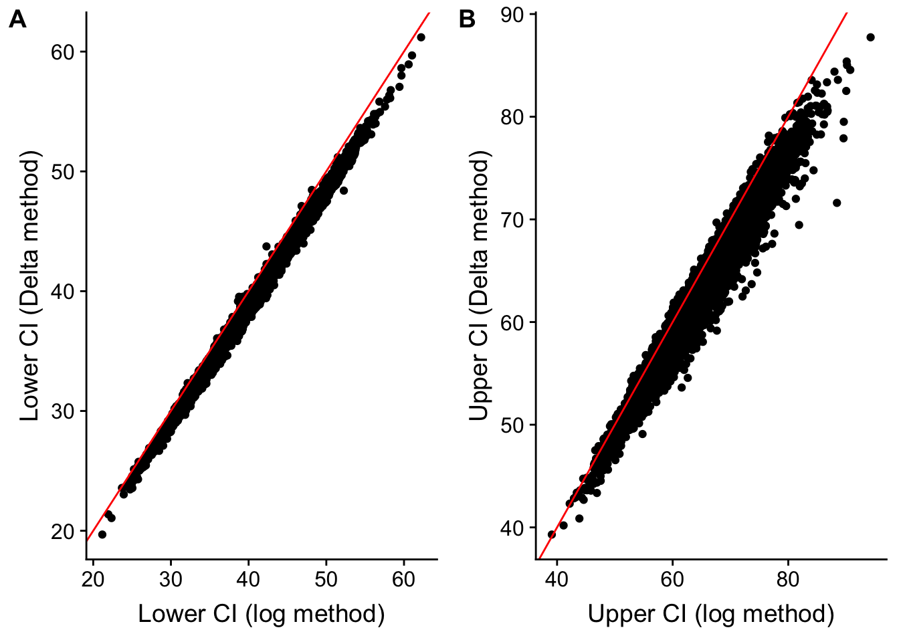

<!-- rnb-text-begin -->

---
title: "Reporting effects as relative differences with a confidence interval"
output:
  html_notebook:
    code_folding: hide
    theme: united
    toc: true
---


<!-- rnb-text-end -->


<!-- rnb-chunk-begin -->


<!-- rnb-chunk-end -->


<!-- rnb-text-begin -->


<!-- rnb-text-end -->


<!-- rnb-chunk-begin -->


<!-- rnb-chunk-end -->


<!-- rnb-text-begin -->


Researchers frequently report results as relative effects, for example,

"Male flies from selected lines had 50% larger upwind flight ability than male flies from control lines (Control mean: 117.5 cm/s; Selected mean 176.5 cm/s)."

where a relative effect is

\begin{equation}
100 \frac{\bar{y}_B - \bar{y}_A}{\bar{y}_A}
\end{equation}

If we are to follow best practices, we should present this effect with a measure of uncertainty, such as a confidence interval. The absolute effect is 59.0 cm/s and the 95% CI of this effect is (48.7, 69.3 cm/s). But if we present the result as a relative effect, or percent difference from some reference value, how do we compute a "relative CI"?

# Four methods to compute the standard error and CI of a relative effect
## Naive relative confidence intervals

\begin{equation}
relative\_CI = 100\frac{absolute\_CI}{\bar{y}_A}
\end{equation}

For the fly example, the 95% naive relative CIs are $100\frac{48.7}{117.5} = 41.4\%$ and $100\frac{69.3}{117.5} = 59.0\%$. These are easy to compute but wrong because the error in estimating a relative difference is a function of the error in estimating both the numerator (the absolute difference) and the denominator (the reference mean). The consequence is that naive relative confidence intervals are too narrow (or too optimistic, or suggest too much precision).

## Back-transformed intervals from log-transformed data.

This post is motivated by the post [The percent difference fallacy and a solution: the ratio t-test](http://scienceblog.darrouzet-nardi.net/?p=2066) from Anthony Darrouzet-Nardi at [Anthony's Science blog](http://scienceblog.darrouzet-nardi.net). Anthony suggests a clever solution for a simple, linear model with a single factor with two levels (or a "t-test" design): the relative CIs are the backtransformed CIs of the effect of the log-transformed data.

1. log transform the response variable
2. run the linear model $log(y) = b_0 + b_1 Treatment$
3. compute the CI of $b_1$
4. backtransform using $100(\mathrm{exp}(CI) - 1)$

Let's think about this.

1. The coefficient $b_1$ of the linear model of log transformed $y$ is $\overline{\mathrm{log}(y_B)} - \overline{\mathrm{log}(y_A)}$
2. This is the difference in the logs of the geometric means of group B and group A, where a geometric mean is
3. $GM=(\Pi y)^\frac{1}{n}$ and the log of a geometric mean is
4. $\mathrm{log}(GM) = \mathrm{log}((\Pi y)^\frac{1}{n}) = \frac{1}{n}\sum{\mathrm{log}(y)}$ (note that the typical way to compute a geometric mean is using a log transformation since this is unlikely to blow up to really big values)
5. And because the difference of two logs is the log of their ratio, $b_1 = \overline{\mathrm{log}(y_B)} - \overline{\mathrm{log}(y_A)} = \mathrm{log}(\frac{GM_B}{GM_A})$, and
6. $\mathrm{exp}(b_1) = \frac{GM_B}{GM_A}$
7. Backtransforming $b_1$ gives us the multiplier. To get the percent difference as a fraction, we need to subtract 1, therefore
8. $\mathrm{exp}(b_1) - 1 = \frac{GM_B}{GM_A} - 1$, which is equal to
9. $\mathrm{exp}(b_1) - 1 = \frac{GM_B}{GM_A} - \frac{GM_A}{GM_A}$, which is equal to
10. $\mathrm{exp}(b_1) - 1 = \frac{GM_B - GM_A}{GM_A}$, so, the relative difference of log-transformed $y$ backtransformed and converted to a percent is

\begin{equation}
100(\mathrm{exp}(b_1) - 1) = 100(\frac{GM_B - GM_A}{GM_A})
\end{equation}

In other words, the CI using the backtransformed CI of the log-transformed $y$ is of the relative difference of the **geometric means**, not the arithmetic means. To think about this estimate of the CI of the relative effect, it helps to remember that the geometric mean is always smaller (closer to zero) than the arithmetic mean, so the numerator is a difference of slightly smaller values, and the denominator is a sligtly smaller values. I'll return to this. A potential problem with this method is, how to generalize it for more complex models, such as single factor models with more than two levels, or factorial models, or models with continuous covariates.

## The Delta method

The relative effect $100\frac{\bar{y}_B - \bar{y}_A}{\bar{y}_A}$ is a non-linear transformation of the absolute effect. The standard error of a non-linear transformation $G(X)$ of random variable can be approximated using a Taylor series approximation, using

\begin{equation}
\mathrm{VAR}(G(X)) \approx \nabla G(X)^\top \mathrm{COV}(X) \nabla G(X)
\end{equation}

where $nabla G(X)$ is the gradient of the function $G(X)$, which is a vector of partial derivatives -- think of this as the vector specifying the direction of the steepest ascent at some point on the surface of $G(X)$.

The Delta method is easily applied to any linear model, including a hierarchical models and generalized linear models. And it is even easier in R thanks to the `deltamethod` function from the msm package.

## Bootstrap standard errors and CI

The bootstrap standard error of a relative effect is simply the standard deviation of the vector of $k$ relative effects, with each relative effect computed from a random sample (with replacement) of the original data. There are several methods for computing a bootstrap CI, the simplest is to simply use percentiles (e.g. 0.025 and 0.975) of the vector of re-sampled relative effects.

# Comparing CIs computed using the naive, log, and Delta methods

Sorry, no comparison with a bootstrap because this is a quick report!

## Single factor with two levels ("t-test")


<!-- rnb-text-end -->


<!-- rnb-chunk-begin -->


<!-- rnb-source-begin eyJkYXRhIjpbInNldC5zZWVkKDEpIiwibiA8LSAyNyAjIGF2ZXJhZ2UgbiBvdmVyIHRoZSBmb3VyIGdyb3VwcyBvZiBmbGllcyIsImIwIDwtIDExNy41ICMgY29udHJvbCBtYWxlcyIsImIxIDwtIDE3Ni41IC0gYjAgIyBlZmZlY3Qgb2Ygc2VsZWN0aW9uIGluIG1hbGVzIiwiIiwiIyBwYXJhbWV0ZXJzIGdhdGhlcmVkIGludG8gdmVjdG9yIiwiYiA8LSBjKGIwLCBiMSkiLCIiLCIjIGVycm9yIHN0YW5kYXJkIGRldmlhdGlvbiIsInNpZ21hIDwtIDE5LjIgIyByZXNpZHVhbCBzdGFuZGFyZCBlcnJvciBvZiBmbHkgZGF0YSIsIiIsIiMgZXhwZWN0ZWQgZWZmZWN0cyBvbiBwZXJjZW50IHNjYWxlIiwiYjEucCA8LSBiMS9iMCoxMDAiLCIiLCIjIG1ha2UgbW9kZWwgbWF0cml4Iiwic2VsZWN0aW9uX2xldmVscyA8LSBjKFwiQ05cIiwgXCJBQVwiKSAjQUEgaXMgc2VsZWN0ZWQiLCJ4IDwtIGRhdGEudGFibGUoVHJlYXRtZW50PWZhY3RvcihyZXAoc2VsZWN0aW9uX2xldmVscywgZWFjaD1uKSwgc2VsZWN0aW9uX2xldmVscykpIiwiWCA8LSBtb2RlbC5tYXRyaXgoZm9ybXVsYSh+VHJlYXRtZW50KSwgeCkiLCIiLCIjIG1ha2UgZGF0YSIsIm5pdGVyIDwtIDEwXjQiLCJyZXMxIDwtIG1hdHJpeChOQSwgbnJvdz1uaXRlciwgbmNvbD0yKSAjIG5haXZlIiwiY29sbmFtZXMocmVzMSkgPC0gYyhcImNpLmxvd1wiLCBcImNpLmhpZ2hcIikiLCJyZXMyIDwtIG1hdHJpeChOQSwgbnJvdz1uaXRlciwgbmNvbD0yKSAjIGxvZyByYXRpbyIsImNvbG5hbWVzKHJlczIpIDwtIGMoXCJjaS5sb3dcIiwgXCJjaS5oaWdoXCIpIiwicmVzMyA8LSBtYXRyaXgoTkEsIG5yb3c9bml0ZXIsIG5jb2w9MikgIyBkZWx0YSIsImNvbG5hbWVzKHJlczMpIDwtIGMoXCJjaS5sb3dcIiwgXCJjaS5oaWdoXCIpIiwiZm9yKGl0ZXIgaW4gMTpuaXRlcil7XG4gIHkgPC0gKFglKiViICsgcm5vcm0obioyLCBzZD1zaWdtYSkpWywxXVxuICBmZCA8LSBkYXRhLnRhYmxlKFk9eSwgeClcbiAgZml0MSA8LSBsbShZflRyZWF0bWVudCwgZGF0YT1mZClcbiAgYmhhdCA8LSBjb2VmKGZpdDEpXG4gIFxuICAjIG5haXZlIG1ldGhvZFxuICBjaSA8LSBjb25maW50KGZpdDEpW1wiVHJlYXRtZW50QUFcIiwgXVxuICByZXMxW2l0ZXIsIF0gPC0gY2kvYmhhdFsxXSoxMDBcbiAgXG4gICMgbG9nIG1ldGhvZFxuICBmaXQxLmxvZyA8LSBsbShsb2coWSl+VHJlYXRtZW50LCBkYXRhPWZkKVxuICBjaSA8LSBleHAoY29uZmludChmaXQxLmxvZylbXCJUcmVhdG1lbnRBQVwiLCBdKS0xXG4gIHJlczJbaXRlciwgXSA8LSBjaSoxMDBcblxuICAjIGRlbHRhIG1ldGhvZFxuICBkZiA8LSBmaXQxJGRmLnJlc2lkdWFsXG4gIHRjcml0IDwtIHF0KC45NzUsIGRmKVxuICBzZCA8LSBzdW1tYXJ5KGZpdDEpJHNpZ21hXG4gIHNlIDwtIGRlbHRhbWV0aG9kKH54Mi94MSwgbWVhbj1jb2VmKGZpdDEpLCBjb3Y9dmNvdihmaXQxKSlcbiAgcmVzM1tpdGVyLCBcImNpLmxvd1wiXSA8LSAxMDAqKGJoYXRbMl0vYmhhdFsxXSAtIHRjcml0KnNlKVxuICByZXMzW2l0ZXIsIFwiY2kuaGlnaFwiXSA8LSAxMDAqKGJoYXRbMl0vYmhhdFsxXSArIHRjcml0KnNlKVxuICBcbiAgIyBmdW4gbWF0aFxuICAjIEcoWCkgPSBiMS9iMCBvciB5L3ggb3IgeDIveDFcbiAgIyBkZWwoeS94KSA9ICh5L3heMiwgMS94KVxuICAjIGRlbChiMS9iMCkgPSAoYjEvYjBeMiwgMS9iMClcbiAgIyBkZWwgPC0gYyhiaGF0WzJdL2JoYXRbMV1eMiwgMS9iaGF0WzFdKVxuICAjIHNlLmZ1biA8LSBzcXJ0KHQoZGVsKSUqJXZjb3YoZml0MSklKiVkZWwpXG59IiwiIiwibmFpdmUgPC0gbGVuZ3RoKHdoaWNoKHJlczFbLFwiY2kubG93XCJdIDwgYjEucCAmIHJlczFbLFwiY2kuaGlnaFwiXSA+IGIxLnApKS9uaXRlcioxMDAiLCJsb2dyYXRpbyA8LSBsZW5ndGgod2hpY2gocmVzMlssXCJjaS5sb3dcIl0gPCBiMS5wICYgcmVzMlssXCJjaS5oaWdoXCJdID4gYjEucCkpL25pdGVyKjEwMCIsImRlbHRhIDwtIGxlbmd0aCh3aGljaChyZXMzWyxcImNpLmxvd1wiXSA8IGIxLnAgJiByZXMzWyxcImNpLmhpZ2hcIl0gPiBiMS5wKSkvbml0ZXIqMTAwIiwiIiwicmVzX3RhYmxlIDwtIGRhdGEudGFibGUoTWV0aG9kPWMoXCJuYWl2ZVwiLCBcImxvZ1wiLCBcImRlbHRhXCIpLFxuICAgICAgICAgICAgICAgICAgICAgICAgQ292ZXJhZ2U9cm91bmQoYyhuYWl2ZSwgbG9ncmF0aW8sIGRlbHRhKSwxKSkiLCJrbml0cjo6a2FibGUocmVzX3RhYmxlKSJdfQ== -->

```r
set.seed(1)
n <- 27 # average n over the four groups of flies
b0 <- 117.5 # control males
b1 <- 176.5 - b0 # effect of selection in males

# parameters gathered into vector
b <- c(b0, b1)

# error standard deviation
sigma <- 19.2 # residual standard error of fly data

# expected effects on percent scale
b1.p <- b1/b0*100

# make model matrix
selection_levels <- c("CN", "AA") #AA is selected
x <- data.table(Treatment=factor(rep(selection_levels, each=n), selection_levels))
X <- model.matrix(formula(~Treatment), x)

# make data
niter <- 10^4
res1 <- matrix(NA, nrow=niter, ncol=2) # naive
colnames(res1) <- c("ci.low", "ci.high")
res2 <- matrix(NA, nrow=niter, ncol=2) # log ratio
colnames(res2) <- c("ci.low", "ci.high")
res3 <- matrix(NA, nrow=niter, ncol=2) # delta
colnames(res3) <- c("ci.low", "ci.high")
for(iter in 1:niter){
  y <- (X%*%b + rnorm(n*2, sd=sigma))[,1]
  fd <- data.table(Y=y, x)
  fit1 <- lm(Y~Treatment, data=fd)
  bhat <- coef(fit1)
  
  # naive method
  ci <- confint(fit1)["TreatmentAA", ]
  res1[iter, ] <- ci/bhat[1]*100
  
  # log method
  fit1.log <- lm(log(Y)~Treatment, data=fd)
  ci <- exp(confint(fit1.log)["TreatmentAA", ])-1
  res2[iter, ] <- ci*100

  # delta method
  df <- fit1$df.residual
  tcrit <- qt(.975, df)
  sd <- summary(fit1)$sigma
  se <- deltamethod(~x2/x1, mean=coef(fit1), cov=vcov(fit1))
  res3[iter, "ci.low"] <- 100*(bhat[2]/bhat[1] - tcrit*se)
  res3[iter, "ci.high"] <- 100*(bhat[2]/bhat[1] + tcrit*se)
  
  # fun math
  # G(X) = b1/b0 or y/x or x2/x1
  # del(y/x) = (y/x^2, 1/x)
  # del(b1/b0) = (b1/b0^2, 1/b0)
  # del <- c(bhat[2]/bhat[1]^2, 1/bhat[1])
  # se.fun <- sqrt(t(del)%*%vcov(fit1)%*%del)
}

naive <- length(which(res1[,"ci.low"] < b1.p & res1[,"ci.high"] > b1.p))/niter*100
logratio <- length(which(res2[,"ci.low"] < b1.p & res2[,"ci.high"] > b1.p))/niter*100
delta <- length(which(res3[,"ci.low"] < b1.p & res3[,"ci.high"] > b1.p))/niter*100

res_table <- data.table(Method=c("naive", "log", "delta"),
                        Coverage=round(c(naive, logratio, delta),1))
knitr::kable(res_table)
```


<!-- rnb-source-end -->


Method    Coverage
-------  ---------
naive         87.6
log           94.5
delta         95.0

<!-- rnb-chunk-end -->


<!-- rnb-text-begin -->


The table above shows the long run ($10^4$ runs) frequency of CIs that include the true relative difference for each of the three methods. The simulation confirms that a naive CI is too narrow, which is why far fewer than 95% of the CIs covered the true value. The narrow interval implies a standard error that is too small, and a $t$-value that is too large, and a $p$-value that is too "optimistic".

Both the log transform and espeically Delta methods have close to the nominal coverage. Nevertheless, there are interesting differences between the log and Delta methods.


<!-- rnb-text-end -->


<!-- rnb-chunk-begin -->


<!-- rnb-source-begin eyJkYXRhIjpbInAxIDwtIHFwbG90KHJlczJbLDFdLCByZXMzWywxXSkgK1xuICB4bGFiKFwiTG93ZXIgQ0kgKGxvZyBtZXRob2QpXCIpICtcbiAgeWxhYihcIkxvd2VyIENJIChEZWx0YSBtZXRob2QpXCIpICtcbiAgZ2VvbV9hYmxpbmUoaW50ZXJjZXB0PTAsIHNsb3BlPTEsIGNvbG9yPVwicmVkXCIpICtcbiAgTlVMTCIsInAyIDwtIHFwbG90KHJlczJbLDJdLCByZXMzWywyXSkgK1xuICB4bGFiKFwiVXBwZXIgQ0kgKGxvZyBtZXRob2QpXCIpICtcbiAgeWxhYihcIlVwcGVyIENJIChEZWx0YSBtZXRob2QpXCIpICtcbiAgZ2VvbV9hYmxpbmUoaW50ZXJjZXB0PTAsIHNsb3BlPTEsIGNvbG9yPVwicmVkXCIpICtcbiAgTlVMTCIsInBsb3RfZ3JpZChwMSwgcDIsIG5jb2w9MiwgbGFiZWxzPVwiQVVUT1wiKSJdfQ== -->

```r
p1 <- qplot(res2[,1], res3[,1]) +
  xlab("Lower CI (log method)") +
  ylab("Lower CI (Delta method)") +
  geom_abline(intercept=0, slope=1, color="red") +
  NULL
p2 <- qplot(res2[,2], res3[,2]) +
  xlab("Upper CI (log method)") +
  ylab("Upper CI (Delta method)") +
  geom_abline(intercept=0, slope=1, color="red") +
  NULL
plot_grid(p1, p2, ncol=2, labels="AUTO")
```


<!-- rnb-source-end -->

<!-- rnb-plot-begin -->



<!-- rnb-plot-end -->

<!-- rnb-chunk-end -->


<!-- rnb-text-begin -->


The plots above show that the CIs estimated using the log transformation is "right" shifted (i.e. to larger values) compared to the CIs estimated using the Delta method. This right shift is because the mean in the denominator of the relative effect is a geometric mean using the log method, but an arithemetic mean using the Delta method. Because a geometric mean is always smaller than the arithmetic mean, the relative effect using the log method will be bigger than the relative effect computed using the Delta method. More curiously, how can both methods have seemingly good coverage if the CI computed using the log method is right-shifted relative to the CI computed using the Delta method?


<!-- rnb-text-end -->


<!-- rnb-chunk-begin -->


<!-- rnb-source-begin eyJkYXRhIjpbImxvZ3JhdGlvLmxvIDwtIGxlbmd0aCh3aGljaChyZXMyWyxcImNpLmxvd1wiXSA+IGIxLnApKS9uaXRlcioxMDAiLCJkZWx0YS5sbyA8LSBsZW5ndGgod2hpY2gocmVzM1ssXCJjaS5sb3dcIl0gPiBiMS5wKSkvbml0ZXIqMTAwIiwibG9ncmF0aW8uaGkgPC0gbGVuZ3RoKHdoaWNoKHJlczJbLFwiY2kuaGlnaFwiXSA8IGIxLnApKS9uaXRlcioxMDAiLCJkZWx0YS5oaSA8LSBsZW5ndGgod2hpY2gocmVzM1ssXCJjaS5oaWdoXCJdIDwgYjEucCkpL25pdGVyKjEwMCIsIiIsInJlc190YWJsZSA8LSBkYXRhLnRhYmxlKE1ldGhvZD1jKFwibG9nXCIsIFwiZGVsdGFcIiksXG4gICAgICAgICAgICAgICAgICAgICAgICBMb3dlcj1yb3VuZChjKGxvZ3JhdGlvLmxvLCBkZWx0YS5sbyksMSksXG4gICAgICAgICAgICAgICAgICAgICAgICBVcHBlcj1yb3VuZChjKGxvZ3JhdGlvLmhpLCBkZWx0YS5oaSksMSlcbiAgICAgICAgICAgICAgICAgICAgICAgICkiLCJrbml0cjo6a2FibGUocmVzX3RhYmxlKSJdfQ== -->

```r
logratio.lo <- length(which(res2[,"ci.low"] > b1.p))/niter*100
delta.lo <- length(which(res3[,"ci.low"] > b1.p))/niter*100
logratio.hi <- length(which(res2[,"ci.high"] < b1.p))/niter*100
delta.hi <- length(which(res3[,"ci.high"] < b1.p))/niter*100

res_table <- data.table(Method=c("log", "delta"),
                        Lower=round(c(logratio.lo, delta.lo),1),
                        Upper=round(c(logratio.hi, delta.hi),1)
                        )
knitr::kable(res_table)
```


<!-- rnb-source-end -->


Method    Lower   Upper
-------  ------  ------
log         3.6     1.8
delta       2.0     3.1

<!-- rnb-chunk-end -->


<!-- rnb-text-begin -->


The table above gives the long run frequency of true relative effects that are less than the lower CI or greater than the upper CI for the log and Delta methods. The log method shows a higher than expected frequency at the lower CI and lower than expected frequency at the upper CI, indicated that the CIs computed using the log transformation are slightly right-shifted. The Delta method shows the opposite pattern, indicating that the CIs computed using the Delta method are slightly left-shifted. I assume these shifts are real (although they may be conditional on the parameterization) and not just sample artifacts. Regardless, despite these shifts, the coverage over the range is close to (or equal to for the Delta method) the expected coverage.

## Single factor with four levels ("post-hoc")

The Delta method is easily applied to more complex designs but its not clear how to implement the log method in more complex designs. For example, if there are four levels in a factor and we want the contrast and CIs for all six pairwise effects, do we just log transform the response and backtransform the CIs of the contrasts (the "whole model" log method) or do we do the log method on all six contrasts independently (the "pairwise" log method)?

Here, I evaluate the two log methods, as well as the naive and Delta methods, by comparing the relative difference of three non-reference levels of the fly data (selected females, control males, selected males) from the reference level (control females or "CN-F").


<!-- rnb-text-end -->


<!-- rnb-chunk-begin -->


<!-- rnb-source-begin eyJkYXRhIjpbIiMgdXNlIHRoZSBmb3VyIGZseSBsZXZlbHMgYnV0IHByZXRlbmQgaXQgaXMgbm90IGZhY3RvcmlhbCIsInNldC5zZWVkKDEpIiwibiA8LSAyNyAjIGF2ZXJhZ2UgbiBvdmVyIHRoZSBmb3VyIGdyb3VwcyBvZiBmbGllcyIsIiMgbWVhbnMiLCJtdSA8LSBjKDEzMS42LCAxODEuMCwgMTE3LjUsIDE3Ni41KSAjQ04tRiwgQUEtRiwgQ04tTSwgQUEtTSIsImIwIDwtIDEzMS42ICMgY29udHJvbCBmZW1hbGVzIiwiYjEgPC0gMTgxLjAgLSBiMCAjIGVmZmVjdCBvZiBzZWxlY3Rpb24gaW4gZmVtYWxlcyIsImIyIDwtIDExNy41IC0gYjAgIyBlZmZlY3Qgb2YgbWFsZSBpbiBjb250cm9sIiwiYjMgPC0gMTc2LjUgLSBiMCAjIGVmZmVjdCBvZiBzZWxlY3Rpb24gYW5kIG1hbGUgLS0gbm90IGFuIGludGVyYWN0aW9uIGVmZmVjdCEiLCIiLCIjIHBhcmFtZXRlcnMgZ2F0aGVyZWQgaW50byB2ZWN0b3IiLCJiIDwtIGMoYjAsIGIxLCBiMiwgYjMpIiwiIiwiIyBlcnJvciBzdGFuZGFyZCBkZXZpYXRpb24iLCJzaWdtYSA8LSAxOS4yICMgcmVzaWR1YWwgc3RhbmRhcmQgZXJyb3Igb2YgZmx5IGRhdGEiLCIiLCIjIGV4cGVjdGVkIGVmZmVjdHMgb24gcmVzcG9uc2UgYW5kIHBlcmNlbnQgc2NhbGUiLCIjIGNhbGwgdGhlIGV4cGVjdGVkIiwiYjEucCA8LSBiMS9iMCoxMDAiLCJiMi5wIDwtIGIyL2IwKjEwMCIsImIzLnAgPC0gYjMvYjAqMTAwIiwiIiwiIyBtYWtlIG1vZGVsIG1hdHJpeCIsIkFfbGV2ZWxzIDwtIGMoXCJDTi1GXCIsIFwiQUEtRlwiLCBcIkNOLU1cIiwgXCJBQS1NXCIpIiwieCA8LSBkYXRhLnRhYmxlKFRyZWF0bWVudD1mYWN0b3IocmVwKEFfbGV2ZWxzLCBlYWNoPW4pLCBmYWN0b3IoQV9sZXZlbHMpKSkiLCJYIDwtIG1vZGVsLm1hdHJpeChmb3JtdWxhKH5UcmVhdG1lbnQpLCB4KSIsIm5fY2VsbHMgPC0gbGVuZ3RoKGxldmVscyh4JFRyZWF0bWVudCkpIiwiIiwiIyBtYWtlIGRhdGEiLCJuaXRlciA8LSAxMF40IiwicmVzMS5sbyA8LSBtYXRyaXgoTkEsIG5yb3c9bml0ZXIsIG5jb2w9MykgIyBuYWl2ZSIsInJlczEudXAgPC0gbWF0cml4KE5BLCBucm93PW5pdGVyLCBuY29sPTMpICMgbmFpdmUiLCJyZXMyLmxvIDwtIG1hdHJpeChOQSwgbnJvdz1uaXRlciwgbmNvbD0zKSAjIGxvZyIsInJlczIudXAgPC0gbWF0cml4KE5BLCBucm93PW5pdGVyLCBuY29sPTMpICMgbG9nIiwicmVzMy5sbyA8LSBtYXRyaXgoTkEsIG5yb3c9bml0ZXIsIG5jb2w9MykgIyBkZWx0YSIsInJlczMudXAgPC0gbWF0cml4KE5BLCBucm93PW5pdGVyLCBuY29sPTMpICMgZGVsdGEiLCJyZXM0LmxvIDwtIG1hdHJpeChOQSwgbnJvdz1uaXRlciwgbmNvbD0zKSAjIGxvZy1wYWlyd2lzZSIsInJlczQudXAgPC0gbWF0cml4KE5BLCBucm93PW5pdGVyLCBuY29sPTMpICMgbG9nLXBhaXJ3aXNlIiwiZm9yKGl0ZXIgaW4gMTpuaXRlcil7IiwiICB5IDwtIChYJSolYiArIHJub3JtKG4qbl9jZWxscywgc2Q9c2lnbWEpKVssMV0iLCIgIGZkIDwtIGRhdGEudGFibGUoWT15LCB4KSIsIiAgZml0MSA8LSBsbShZflRyZWF0bWVudCwgZGF0YT1mZCkiLCIgIGJoYXQgPC0gY29lZihmaXQxKSIsIiAgIyBjb250cmFzdChlbW1lYW5zKGZpdDEsIHNwZWNzPVwiVHJlYXRtZW50XCIpLCBhZGp1c3Q9XCJub25lXCIsIG1ldGhvZD1cInJldnBhaXJ3aXNlXCIpIiwiICAiLCIgICMgbmFpdmUgbWV0aG9kIiwiICBjaS5sbyA8LSBjb25maW50KGZpdDEpWzI6NCwgXCIyLjUgJVwiXSIsIiAgY2kudXAgPC0gY29uZmludChmaXQxKVsyOjQsIFwiOTcuNSAlXCJdIiwiICByZXMxLmxvW2l0ZXIsIF0gPC0gY2kubG8vYmhhdFsxXSoxMDAiLCIgIHJlczEudXBbaXRlciwgXSA8LSBjaS51cC9iaGF0WzFdKjEwMCIsIiAgIiwiICAjIGxvZyBtZXRob2QgMSAtIHJ1biBldmVyeXRoaW5nIGF0IG9uY2UiLCIgIGZpdDIgPC0gbG0obG9nKFkpflRyZWF0bWVudCwgZGF0YT1mZCkiLCIgIGNpLmxvIDwtIGV4cChjb25maW50KGZpdDIpWzI6NCwgXCIyLjUgJVwiXSkgLSAxIiwiICBjaS51cCA8LSBleHAoY29uZmludChmaXQyKVsyOjQsIFwiOTcuNSAlXCJdKSAtIDEiLCIgIHJlczIubG9baXRlciwgXSA8LSBjaS5sbyoxMDAiLCIgIHJlczIudXBbaXRlciwgXSA8LSBjaS51cCoxMDAiLCIgICIsIiAgIyBsb2cgbWV0aG9kIDIgLS0gcGFpcndpc2UiLCIgIGZpdDIgPC0gbG0obG9nKFkpflRyZWF0bWVudCwgZGF0YT1mZFtUcmVhdG1lbnQ9PVwiQ04tRlwiIHwgVHJlYXRtZW50PT1cIkFBLUZcIl0pIiwiICBjaS5sbyA8LSBleHAoY29uZmludChmaXQyKVsyLCBcIjIuNSAlXCJdKSAtIDEiLCIgIGNpLnVwIDwtIGV4cChjb25maW50KGZpdDIpWzIsIFwiOTcuNSAlXCJdKSAtIDEiLCIgIHJlczQubG9baXRlciwgMV0gPC0gY2kubG8qMTAwIiwiICByZXM0LnVwW2l0ZXIsIDFdIDwtIGNpLnVwKjEwMCIsIiIsIiAgZml0MiA8LSBsbShsb2coWSl+VHJlYXRtZW50LCBkYXRhPWZkW1RyZWF0bWVudD09XCJDTi1GXCIgfCBUcmVhdG1lbnQ9PVwiQ04tTVwiXSkiLCIgIGNpLmxvIDwtIGV4cChjb25maW50KGZpdDIpWzIsIFwiMi41ICVcIl0pIC0gMSIsIiAgY2kudXAgPC0gZXhwKGNvbmZpbnQoZml0MilbMiwgXCI5Ny41ICVcIl0pIC0gMSIsIiAgcmVzNC5sb1tpdGVyLCAyXSA8LSBjaS5sbyoxMDAiLCIgIHJlczQudXBbaXRlciwgMl0gPC0gY2kudXAqMTAwIiwiIiwiICBmaXQyIDwtIGxtKGxvZyhZKX5UcmVhdG1lbnQsIGRhdGE9ZmRbVHJlYXRtZW50PT1cIkNOLUZcIiB8IFRyZWF0bWVudD09XCJBQS1NXCJdKSIsIiAgY2kubG8gPC0gZXhwKGNvbmZpbnQoZml0MilbMiwgXCIyLjUgJVwiXSkgLSAxIiwiICBjaS51cCA8LSBleHAoY29uZmludChmaXQyKVsyLCBcIjk3LjUgJVwiXSkgLSAxIiwiICByZXM0LmxvW2l0ZXIsIDNdIDwtIGNpLmxvKjEwMCIsIiAgcmVzNC51cFtpdGVyLCAzXSA8LSBjaS51cCoxMDAiLCIiLCIgICMgZGVsdGEgbWV0aG9kIiwiICBkZiA8LSBmaXQxJGRmLnJlc2lkdWFsIiwiICB0Y3JpdCA8LSBxdCguOTc1LCBkZikiLCIgIHNkIDwtIHN1bW1hcnkoZml0MSkkc2lnbWEiLCIgIHNlIDwtIGMoIiwiICAgIGRlbHRhbWV0aG9kKH54Mi94MSwgbWVhbj1jb2VmKGZpdDEpLCBjb3Y9dmNvdihmaXQxKSksIiwiICAgIGRlbHRhbWV0aG9kKH54My94MSwgbWVhbj1jb2VmKGZpdDEpLCBjb3Y9dmNvdihmaXQxKSksIiwiICAgIGRlbHRhbWV0aG9kKH54NC94MSwgbWVhbj1jb2VmKGZpdDEpLCBjb3Y9dmNvdihmaXQxKSkiLCIgICkiLCIgIHJlczMubG9baXRlciwgXSA8LSAxMDAqKGJoYXRbMjo0XS9iaGF0WzFdIC0gdGNyaXQqc2UpIiwiICByZXMzLnVwW2l0ZXIsIF0gPC0gMTAwKihiaGF0WzI6NF0vYmhhdFsxXSArIHRjcml0KnNlKSIsIn0iLCIiLCJuYWl2ZSA8LSBjKGxlbmd0aCh3aGljaChyZXMxLmxvWywxXSA8IGIxLnAgJiByZXMxLnVwWywxXSA+IGIxLnApKS9uaXRlcioxMDAsIiwiICAgICAgICAgICBsZW5ndGgod2hpY2gocmVzMS5sb1ssMl0gPCBiMi5wICYgcmVzMS51cFssMl0gPiBiMi5wKSkvbml0ZXIqMTAwLCIsIiAgICAgICAgICAgbGVuZ3RoKHdoaWNoKHJlczEubG9bLDNdIDwgYjMucCAmIHJlczEudXBbLDNdID4gYjMucCkpL25pdGVyKjEwMCIsIikiLCJsb2dyYXRpbzEgPC0gYyhsZW5ndGgod2hpY2gocmVzMi5sb1ssMV0gPCBiMS5wICYgcmVzMi51cFssMV0gPiBiMS5wKSkvbml0ZXIqMTAwLCIsIiAgICAgICAgICAgICAgbGVuZ3RoKHdoaWNoKHJlczIubG9bLDJdIDwgYjIucCAmIHJlczIudXBbLDJdID4gYjIucCkpL25pdGVyKjEwMCwiLCIgICAgICAgICAgICAgIGxlbmd0aCh3aGljaChyZXMyLmxvWywzXSA8IGIzLnAgJiByZXMyLnVwWywzXSA+IGIzLnApKS9uaXRlcioxMDAiLCIpIiwibG9ncmF0aW8yIDwtIGMobGVuZ3RoKHdoaWNoKHJlczQubG9bLDFdIDwgYjEucCAmIHJlczQudXBbLDFdID4gYjEucCkpL25pdGVyKjEwMCwiLCIgICAgICAgICAgICAgIGxlbmd0aCh3aGljaChyZXM0LmxvWywyXSA8IGIyLnAgJiByZXM0LnVwWywyXSA+IGIyLnApKS9uaXRlcioxMDAsIiwiICAgICAgICAgICAgICBsZW5ndGgod2hpY2gocmVzNC5sb1ssM10gPCBiMy5wICYgcmVzNC51cFssM10gPiBiMy5wKSkvbml0ZXIqMTAwIiwiKSIsImRlbHRhIDwtIGMobGVuZ3RoKHdoaWNoKHJlczMubG9bLDFdIDwgYjEucCAmIHJlczMudXBbLDFdID4gYjEucCkpL25pdGVyKjEwMCwiLCIgICAgICAgICAgIGxlbmd0aCh3aGljaChyZXMzLmxvWywyXSA8IGIyLnAgJiByZXMzLnVwWywyXSA+IGIyLnApKS9uaXRlcioxMDAsIiwiICAgICAgICAgICBsZW5ndGgod2hpY2gocmVzMy5sb1ssM10gPCBiMy5wICYgcmVzMy51cFssM10gPiBiMy5wKSkvbml0ZXIqMTAwIiwiKSIsInJlcy50YWJsZSA8LSBkYXRhLnRhYmxlKHJiaW5kKG5haXZlLCBsb2dyYXRpbzEsIGxvZ3JhdGlvMiwgZGVsdGEpKSIsImNvbG5hbWVzKHJlcy50YWJsZSkgPC0gYyhcIkFBRi1DTkZcIiwgXCJDTk0tQ05GXCIsIFwiQUFNLUNORlwiKSIsInJlcy50YWJsZSA8LSBjYmluZChNZXRob2Q9YyhcIm5haXZlXCIsIFwibG9nXCIsIFwibG9nLXB3XCIsIFwiRGVsdGFcIiksIHJlcy50YWJsZSkiLCJrbml0cjo6a2FibGUocmVzLnRhYmxlLCBkaWdpdHM9YygwLDEsMSwxKSkiXX0= -->

```r
# use the four fly levels but pretend it is not factorial
set.seed(1)
n <- 27 # average n over the four groups of flies
# means
mu <- c(131.6, 181.0, 117.5, 176.5) #CN-F, AA-F, CN-M, AA-M
b0 <- 131.6 # control females
b1 <- 181.0 - b0 # effect of selection in females
b2 <- 117.5 - b0 # effect of male in control
b3 <- 176.5 - b0 # effect of selection and male -- not an interaction effect!

# parameters gathered into vector
b <- c(b0, b1, b2, b3)

# error standard deviation
sigma <- 19.2 # residual standard error of fly data

# expected effects on response and percent scale
# call the expected
b1.p <- b1/b0*100
b2.p <- b2/b0*100
b3.p <- b3/b0*100

# make model matrix
A_levels <- c("CN-F", "AA-F", "CN-M", "AA-M")
x <- data.table(Treatment=factor(rep(A_levels, each=n), factor(A_levels)))
X <- model.matrix(formula(~Treatment), x)
n_cells <- length(levels(x$Treatment))

# make data
niter <- 10^4
res1.lo <- matrix(NA, nrow=niter, ncol=3) # naive
res1.up <- matrix(NA, nrow=niter, ncol=3) # naive
res2.lo <- matrix(NA, nrow=niter, ncol=3) # log
res2.up <- matrix(NA, nrow=niter, ncol=3) # log
res3.lo <- matrix(NA, nrow=niter, ncol=3) # delta
res3.up <- matrix(NA, nrow=niter, ncol=3) # delta
res4.lo <- matrix(NA, nrow=niter, ncol=3) # log-pairwise
res4.up <- matrix(NA, nrow=niter, ncol=3) # log-pairwise
for(iter in 1:niter){
  y <- (X%*%b + rnorm(n*n_cells, sd=sigma))[,1]
  fd <- data.table(Y=y, x)
  fit1 <- lm(Y~Treatment, data=fd)
  bhat <- coef(fit1)
  # contrast(emmeans(fit1, specs="Treatment"), adjust="none", method="revpairwise")
  
  # naive method
  ci.lo <- confint(fit1)[2:4, "2.5 %"]
  ci.up <- confint(fit1)[2:4, "97.5 %"]
  res1.lo[iter, ] <- ci.lo/bhat[1]*100
  res1.up[iter, ] <- ci.up/bhat[1]*100
  
  # log method 1 - run everything at once
  fit2 <- lm(log(Y)~Treatment, data=fd)
  ci.lo <- exp(confint(fit2)[2:4, "2.5 %"]) - 1
  ci.up <- exp(confint(fit2)[2:4, "97.5 %"]) - 1
  res2.lo[iter, ] <- ci.lo*100
  res2.up[iter, ] <- ci.up*100
  
  # log method 2 -- pairwise
  fit2 <- lm(log(Y)~Treatment, data=fd[Treatment=="CN-F" | Treatment=="AA-F"])
  ci.lo <- exp(confint(fit2)[2, "2.5 %"]) - 1
  ci.up <- exp(confint(fit2)[2, "97.5 %"]) - 1
  res4.lo[iter, 1] <- ci.lo*100
  res4.up[iter, 1] <- ci.up*100

  fit2 <- lm(log(Y)~Treatment, data=fd[Treatment=="CN-F" | Treatment=="CN-M"])
  ci.lo <- exp(confint(fit2)[2, "2.5 %"]) - 1
  ci.up <- exp(confint(fit2)[2, "97.5 %"]) - 1
  res4.lo[iter, 2] <- ci.lo*100
  res4.up[iter, 2] <- ci.up*100

  fit2 <- lm(log(Y)~Treatment, data=fd[Treatment=="CN-F" | Treatment=="AA-M"])
  ci.lo <- exp(confint(fit2)[2, "2.5 %"]) - 1
  ci.up <- exp(confint(fit2)[2, "97.5 %"]) - 1
  res4.lo[iter, 3] <- ci.lo*100
  res4.up[iter, 3] <- ci.up*100

  # delta method
  df <- fit1$df.residual
  tcrit <- qt(.975, df)
  sd <- summary(fit1)$sigma
  se <- c(
    deltamethod(~x2/x1, mean=coef(fit1), cov=vcov(fit1)),
    deltamethod(~x3/x1, mean=coef(fit1), cov=vcov(fit1)),
    deltamethod(~x4/x1, mean=coef(fit1), cov=vcov(fit1))
  )
  res3.lo[iter, ] <- 100*(bhat[2:4]/bhat[1] - tcrit*se)
  res3.up[iter, ] <- 100*(bhat[2:4]/bhat[1] + tcrit*se)
}

naive <- c(length(which(res1.lo[,1] < b1.p & res1.up[,1] > b1.p))/niter*100,
           length(which(res1.lo[,2] < b2.p & res1.up[,2] > b2.p))/niter*100,
           length(which(res1.lo[,3] < b3.p & res1.up[,3] > b3.p))/niter*100
)
logratio1 <- c(length(which(res2.lo[,1] < b1.p & res2.up[,1] > b1.p))/niter*100,
              length(which(res2.lo[,2] < b2.p & res2.up[,2] > b2.p))/niter*100,
              length(which(res2.lo[,3] < b3.p & res2.up[,3] > b3.p))/niter*100
)
logratio2 <- c(length(which(res4.lo[,1] < b1.p & res4.up[,1] > b1.p))/niter*100,
              length(which(res4.lo[,2] < b2.p & res4.up[,2] > b2.p))/niter*100,
              length(which(res4.lo[,3] < b3.p & res4.up[,3] > b3.p))/niter*100
)
delta <- c(length(which(res3.lo[,1] < b1.p & res3.up[,1] > b1.p))/niter*100,
           length(which(res3.lo[,2] < b2.p & res3.up[,2] > b2.p))/niter*100,
           length(which(res3.lo[,3] < b3.p & res3.up[,3] > b3.p))/niter*100
)
res.table <- data.table(rbind(naive, logratio1, logratio2, delta))
colnames(res.table) <- c("AAF-CNF", "CNM-CNF", "AAM-CNF")
res.table <- cbind(Method=c("naive", "log", "log-pw", "Delta"), res.table)
knitr::kable(res.table, digits=c(0,1,1,1))
```


<!-- rnb-source-end -->

<!-- rnb-chunk-end -->


<!-- rnb-text-begin -->


The table above shows the long run ($10^4$ runs) frequency of CIs that include the true relative difference for each of the three contrasts (differences from CN-F) for each of the four methods, including both the whole-model and pairwise log methods. The whole-model log method can have intervals that are two narrow, as indicated by the lower-than-nominal frequency for the CN-F relative difference. The frequencies of the run-pairwise log method and Deta method look pretty good, but this is only one parameterization.

## 2 x 2 factorial

<!-- rnb-text-end -->


<!-- rnb-chunk-begin -->


<!-- rnb-source-begin eyJkYXRhIjpbIiMgdXNlIHRoZSBmb3VyIGZseSBsZXZlbHMgYnV0IHByZXRlbmQgaXQgaXMgbm90IGZhY3RvcmlhbCIsInNldC5zZWVkKDEpIiwibiA8LSAyNyAjIGF2ZXJhZ2UgbiBvdmVyIHRoZSBmb3VyIGdyb3VwcyBvZiBmbGllcyIsIiMgbWVhbnMiLCJtdSA8LSBjKDEzMS42LCAxODEuMCwgMTE3LjUsIDE3Ni41KSAjQ04tRiwgQUEtRiwgQ04tTSwgQUEtTSIsImIwIDwtIDEzMS42ICMgY29udHJvbCBmZW1hbGVzIiwiYjEgPC0gMTgxLjAgLSBiMCAjIGVmZmVjdCBvZiBzZWxlY3Rpb24gaW4gZmVtYWxlcyIsImIyIDwtIDExNy41IC0gYjAgIyBlZmZlY3Qgb2YgbWFsZSBpbiBjb250cm9sIiwiYjMgPC0gMTc2LjUgLSAoYjAgKyBiMSArIGIyKSAjIGludGVyYWN0aW9uIGVmZmVjdCEiLCIiLCIjIHBhcmFtZXRlcnMgZ2F0aGVyZWQgaW50byB2ZWN0b3IiLCJiIDwtIGMoYjAsIGIxLCBiMiwgYjMpIiwiIiwiIyBlcnJvciBzdGFuZGFyZCBkZXZpYXRpb24iLCJzaWdtYSA8LSAxOS4yICMgcmVzaWR1YWwgc3RhbmRhcmQgZXJyb3Igb2YgZmx5IGRhdGEiLCIiLCIjIGV4cGVjdGVkIGVmZmVjdHMgb24gcmVzcG9uc2UgYW5kIHBlcmNlbnQgc2NhbGUiLCIjIHRoZXJlIGFyZSAyIHggMiA9IGZvdXIgcGFpcndpc2UgZWZmZWN0cyAob2Ygb25lIHRyZWF0bWVudCB3aXRoaW4gZWFjaCBsZXZlbCBvZiB0aGUgb3RoZXIgdHJlYXRtZW50KSIsIiMgY2FsbCB0aGVzZSBBMCBhbmQgQTEsIEIwIGFuZCBCMSIsIiMgY2FsbCB0aGUgZXhwZWN0ZWQiLCJBMCA8LSBiMSIsIkExIDwtICgoYjArYjErYjIrYjMpLShiMCtiMikpIiwiQTAucCA8LSAxMDAqQTAvYjAiLCJBMS5wIDwtIDEwMCpBMS8oYjArYjIpIiwiIiwiIyBtYWtlIG1vZGVsIG1hdHJpeCIsIkFfbGV2ZWxzIDwtIGZhY3RvcihyZXAoYyhcIkNOXCIsIFwiQUFcIiksIGVhY2g9biksIGMoXCJDTlwiLCBcIkFBXCIpKSIsIkJfbGV2ZWxzIDwtIGZhY3RvcihjKFwiRlwiLCBcIk1cIikpIiwieCA8LSBleHBhbmQuZ3JpZChUcmVhdG1lbnQ9QV9sZXZlbHMsU2V4PUJfbGV2ZWxzKSIsIlggPC0gbW9kZWwubWF0cml4KGZvcm11bGEoflRyZWF0bWVudCpTZXgpLCB4KSIsIiIsIiIsInNldC5zZWVkKDEpIiwibml0ZXIgPC0gMTBeNCIsIm1ldGhvZHMgPC0gYyhcIm5haXZlXCIsIFwibG9nXCIsIFwibG9nLXB3XCIsIFwiRGVsdGFcIikiLCJuLm1ldGhvZHMgPC0gbGVuZ3RoKG1ldGhvZHMpIiwicmVzIDwtIGRhdGEuZnJhbWUobWV0aG9kPXJlcChtZXRob2RzLCBuaXRlciksXG4gICAgICAgICAgICAgICAgICBBMC5sbz1OQSxcbiAgICAgICAgICAgICAgICAgIEEwLnVwPU5BLFxuICAgICAgICAgICAgICAgICAgQTEubG89TkEsXG4gICAgICAgICAgICAgICAgICBBMS51cD1OQSkiLCJyb3cuZSA8LSAwICMgZW5kIHJvdyBmb3Igc2F2aW5nICIsImZvcihpdGVyIGluIDE6bml0ZXIpe1xuICAjIG1ha2UgZGF0YVxuICB5IDwtIChYJSolYiArIHJub3JtKG4qNCwgc2Q9c2lnbWEpKVssMV1cbiAgZmQgPC0gZGF0YS50YWJsZShZPXksIHgpXG4gIFxuICAjIGZpdFxuICBmaXQgPC0gbG0oWX5UcmVhdG1lbnQqU2V4LCBkYXRhPWZkKVxuICBmaXQuZW1tIDwtIGVtbWVhbnMoZml0LCBzcGVjcz1jKFwiVHJlYXRtZW50XCIsIFwiU2V4XCIpKVxuICBmaXQuZWZmIDwtIHN1bW1hcnkoY29udHJhc3QoZml0LmVtbSwgYWRqdXN0PVwibm9uZVwiLCBtZXRob2Q9XCJyZXZwYWlyd2lzZVwiKSwgaW5mZXI9YyhUUlVFLCBUUlVFKSlcbiAgXG4gICMgY2VsbCBtZWFuc1xuICB5YmFyMTEgPC0gc3VtbWFyeShmaXQuZW1tKVsxLCBcImVtbWVhblwiXSAjIENOLUZcbiAgeWJhcjIxIDwtIHN1bW1hcnkoZml0LmVtbSlbMiwgXCJlbW1lYW5cIl0gIyBBQS1GXG4gIHliYXIxMiA8LSBzdW1tYXJ5KGZpdC5lbW0pWzMsIFwiZW1tZWFuXCJdICMgQ04tTVxuICB5YmFyMjIgPC0gc3VtbWFyeShmaXQuZW1tKVs0LCBcImVtbWVhblwiXSAjIEFBLU1cbiAgXG4gICMgbmFpdmUgY29udmVydCBDSSB0byBwZXJjZW50XG4gIG5haXZlIDwtIDEwMCpjKFxuICAgIGZpdC5lZmZbMSwgXCJsb3dlci5DTFwiXS95YmFyMTEsXG4gICAgZml0LmVmZlsxLCBcInVwcGVyLkNMXCJdL3liYXIxMSxcbiAgICBmaXQuZWZmWzYsIFwibG93ZXIuQ0xcIl0veWJhcjEyLFxuICAgIGZpdC5lZmZbNiwgXCJ1cHBlci5DTFwiXS95YmFyMTJcbiAgKVxuXG4gICMgbG9nIG1ldGhvZCAxIC0tIHJ1biBldmVyeXRoaW5nIGF0IG9uY2VcbiAgZml0MiA8LSBsbShsb2coWSl+VHJlYXRtZW50KlNleCwgZGF0YT1mZClcbiAgZml0Mi5lbW0gPC0gZW1tZWFucyhmaXQyLCBzcGVjcz1jKFwiVHJlYXRtZW50XCIsIFwiU2V4XCIpKVxuICBmaXQyLmVmZiA8LSBzdW1tYXJ5KGNvbnRyYXN0KGZpdDIuZW1tLCBhZGp1c3Q9XCJub25lXCIsIG1ldGhvZD1cInJldnBhaXJ3aXNlXCIpLCBpbmZlcj1jKFRSVUUsIFRSVUUpKVxuICBsb2dyYXRpbzEgPC0gMTAwKmMoXG4gICAgZXhwKGZpdDIuZWZmWzEsIFwibG93ZXIuQ0xcIl0pLTEsXG4gICAgZXhwKGZpdDIuZWZmWzEsIFwidXBwZXIuQ0xcIl0pLTEsXG4gICAgZXhwKGZpdDIuZWZmWzYsIFwibG93ZXIuQ0xcIl0pLTEsXG4gICAgZXhwKGZpdDIuZWZmWzYsIFwidXBwZXIuQ0xcIl0pLTFcbiAgKVxuICBcbiAgIyBsb2cgbWV0aG9kIDIgLS0gcGFpcndpc2VcbiAgY29tYm9zIDwtIGMoXCJDTi1GXCIsIFwiQUEtRlwiLCBcIkNOLU1cIiwgXCJBQS1NXCIpXG4gIGZkWywgY29tYm86PWZhY3RvcihwYXN0ZShUcmVhdG1lbnQsIFNleCwgc2VwPVwiLVwiKSwgY29tYm9zKV1cbiAgZml0MiA8LSBsbShsb2coWSl+Y29tYm8sIGRhdGE9ZmRbY29tYm89PVwiQ04tRlwiIHwgY29tYm89PVwiQUEtRlwiXSlcbiAgY2kubG8xIDwtIGV4cChjb25maW50KGZpdDIpWzIsIFwiMi41ICVcIl0pIC0gMVxuICBjaS51cDEgPC0gZXhwKGNvbmZpbnQoZml0MilbMiwgXCI5Ny41ICVcIl0pIC0gMVxuXG4gIGZpdDIgPC0gbG0obG9nKFkpfmNvbWJvLCBkYXRhPWZkW2NvbWJvPT1cIkNOLU1cIiB8IGNvbWJvPT1cIkFBLU1cIl0pXG4gIGNpLmxvMiA8LSBleHAoY29uZmludChmaXQyKVsyLCBcIjIuNSAlXCJdKSAtIDFcbiAgY2kudXAyIDwtIGV4cChjb25maW50KGZpdDIpWzIsIFwiOTcuNSAlXCJdKSAtIDFcbiAgXG4gIGxvZ3JhdGlvMiA8LSAxMDAqYyhjaS5sbzEsIGNpLnVwMSwgY2kubG8yLCBjaS51cDIpXG5cbiAgIyBkZWx0YVxuICBBMGhhdC5wIDwtIGZpdC5lZmZbMSwgXCJlc3RpbWF0ZVwiXS95YmFyMTFcbiAgQTFoYXQucCA8LSBmaXQuZWZmWzYsIFwiZXN0aW1hdGVcIl0veWJhcjEyXG4gIHNlIDwtIGMoXG4gICAgZGVsdGFtZXRob2QofngyL3gxLCBtZWFuPWNvZWYoZml0KSwgY292PXZjb3YoZml0KSksXG4gICAgZGVsdGFtZXRob2Qofih4Mit4NCkvKHgxK3gzKSwgbWVhbj1jb2VmKGZpdCksIGNvdj12Y292KGZpdCkpXG4gIClcbiAgZGVsdGEgPC0gMTAwKmMoXG4gICAgQTBoYXQucC10Y3JpdCpzZVsxXSxcbiAgICBBMGhhdC5wK3Rjcml0KnNlWzFdLFxuICAgIEExaGF0LnAtdGNyaXQqc2VbMl0sXG4gICAgQTFoYXQucCt0Y3JpdCpzZVsyXVxuICApXG4gIHJvdy5zIDwtIHJvdy5lICsgMVxuICByb3cuZSA8LSByb3cucyArIG4ubWV0aG9kcyAtIDFcbiAgcmVzW3Jvdy5zOnJvdy5lLCAyOihuLm1ldGhvZHMrMSldIDwtcmJpbmQobmFpdmUsIGxvZ3JhdGlvMSwgbG9ncmF0aW8yLCBkZWx0YSlcbn0iLCJyZXMgPC0gZGF0YS50YWJsZShyZXMpIiwiIiwibWV0aG9kX2sgPC0gXCJuYWl2ZVwiIiwibmFpdmUgPC0gYyhcbiAgbGVuZ3RoKHdoaWNoKHJlc1ttZXRob2Q9PW1ldGhvZF9rLEEwLmxvXSA8IEEwLnAgJiByZXNbbWV0aG9kPT1tZXRob2RfayxBMC51cF0gPiBBMC5wKSkvbml0ZXIqMTAwLFxuICBsZW5ndGgod2hpY2gocmVzW21ldGhvZD09bWV0aG9kX2ssQTEubG9dIDwgQTEucCAmIHJlc1ttZXRob2Q9PW1ldGhvZF9rLEExLnVwXSA+IEExLnApKS9uaXRlcioxMDBcbikiLCIiLCJtZXRob2RfayA8LSBcImxvZ1wiIiwibG9ncmF0aW8xIDwtIGMoXG4gIGxlbmd0aCh3aGljaChyZXNbbWV0aG9kPT1tZXRob2RfayxBMC5sb10gPCBBMC5wICYgcmVzW21ldGhvZD09bWV0aG9kX2ssQTAudXBdID4gQTAucCkpL25pdGVyKjEwMCxcbiAgbGVuZ3RoKHdoaWNoKHJlc1ttZXRob2Q9PW1ldGhvZF9rLEExLmxvXSA8IEExLnAgJiByZXNbbWV0aG9kPT1tZXRob2RfayxBMS51cF0gPiBBMS5wKSkvbml0ZXIqMTAwXG4pIiwiIiwibWV0aG9kX2sgPC0gXCJsb2ctcHdcIiIsImxvZ3JhdGlvMiA8LSBjKFxuICBsZW5ndGgod2hpY2gocmVzW21ldGhvZD09bWV0aG9kX2ssQTAubG9dIDwgQTAucCAmIHJlc1ttZXRob2Q9PW1ldGhvZF9rLEEwLnVwXSA+IEEwLnApKS9uaXRlcioxMDAsXG4gIGxlbmd0aCh3aGljaChyZXNbbWV0aG9kPT1tZXRob2RfayxBMS5sb10gPCBBMS5wICYgcmVzW21ldGhvZD09bWV0aG9kX2ssQTEudXBdID4gQTEucCkpL25pdGVyKjEwMFxuKSIsIiIsIm1ldGhvZF9rIDwtIFwiRGVsdGFcIiIsImRlbHRhIDwtIGMoXG4gIGxlbmd0aCh3aGljaChyZXNbbWV0aG9kPT1tZXRob2RfayxBMC5sb10gPCBBMC5wICYgcmVzW21ldGhvZD09bWV0aG9kX2ssQTAudXBdID4gQTAucCkpL25pdGVyKjEwMCxcbiAgbGVuZ3RoKHdoaWNoKHJlc1ttZXRob2Q9PW1ldGhvZF9rLEExLmxvXSA8IEExLnAgJiByZXNbbWV0aG9kPT1tZXRob2RfayxBMS51cF0gPiBBMS5wKSkvbml0ZXIqMTAwXG4pIiwiIiwicmVzLnRhYmxlIDwtIGRhdGEudGFibGUocmJpbmQobmFpdmUsIGxvZ3JhdGlvMSwgbG9ncmF0aW8yLCBkZWx0YSkpIiwiY29sbmFtZXMocmVzLnRhYmxlKSA8LSBjKFwiQUFGLUNORlwiLCBcIkFBTS1DTk1cIikiLCJyZXMudGFibGUgPC0gY2JpbmQoTWV0aG9kPWMoXCJuYWl2ZVwiLCBcImxvZ1wiLCBcImxvZy1wd1wiLCBcIkRlbHRhXCIpLCByZXMudGFibGUpIiwia25pdHI6OmthYmxlKHJlcy50YWJsZSwgZGlnaXRzPWMoMCwxLDEpKSJdfQ== -->

```r
# use the four fly levels but pretend it is not factorial
set.seed(1)
n <- 27 # average n over the four groups of flies
# means
mu <- c(131.6, 181.0, 117.5, 176.5) #CN-F, AA-F, CN-M, AA-M
b0 <- 131.6 # control females
b1 <- 181.0 - b0 # effect of selection in females
b2 <- 117.5 - b0 # effect of male in control
b3 <- 176.5 - (b0 + b1 + b2) # interaction effect!

# parameters gathered into vector
b <- c(b0, b1, b2, b3)

# error standard deviation
sigma <- 19.2 # residual standard error of fly data

# expected effects on response and percent scale
# there are 2 x 2 = four pairwise effects (of one treatment within each level of the other treatment)
# call these A0 and A1, B0 and B1
# call the expected
A0 <- b1
A1 <- ((b0+b1+b2+b3)-(b0+b2))
A0.p <- 100*A0/b0
A1.p <- 100*A1/(b0+b2)

# make model matrix
A_levels <- factor(rep(c("CN", "AA"), each=n), c("CN", "AA"))
B_levels <- factor(c("F", "M"))
x <- expand.grid(Treatment=A_levels,Sex=B_levels)
X <- model.matrix(formula(~Treatment*Sex), x)


set.seed(1)
niter <- 10^4
methods <- c("naive", "log", "log-pw", "Delta")
n.methods <- length(methods)
res <- data.frame(method=rep(methods, niter),
                  A0.lo=NA,
                  A0.up=NA,
                  A1.lo=NA,
                  A1.up=NA)
row.e <- 0 # end row for saving 
for(iter in 1:niter){
  # make data
  y <- (X%*%b + rnorm(n*4, sd=sigma))[,1]
  fd <- data.table(Y=y, x)
  
  # fit
  fit <- lm(Y~Treatment*Sex, data=fd)
  fit.emm <- emmeans(fit, specs=c("Treatment", "Sex"))
  fit.eff <- summary(contrast(fit.emm, adjust="none", method="revpairwise"), infer=c(TRUE, TRUE))
  
  # cell means
  ybar11 <- summary(fit.emm)[1, "emmean"] # CN-F
  ybar21 <- summary(fit.emm)[2, "emmean"] # AA-F
  ybar12 <- summary(fit.emm)[3, "emmean"] # CN-M
  ybar22 <- summary(fit.emm)[4, "emmean"] # AA-M
  
  # naive convert CI to percent
  naive <- 100*c(
    fit.eff[1, "lower.CL"]/ybar11,
    fit.eff[1, "upper.CL"]/ybar11,
    fit.eff[6, "lower.CL"]/ybar12,
    fit.eff[6, "upper.CL"]/ybar12
  )

  # log method 1 -- run everything at once
  fit2 <- lm(log(Y)~Treatment*Sex, data=fd)
  fit2.emm <- emmeans(fit2, specs=c("Treatment", "Sex"))
  fit2.eff <- summary(contrast(fit2.emm, adjust="none", method="revpairwise"), infer=c(TRUE, TRUE))
  logratio1 <- 100*c(
    exp(fit2.eff[1, "lower.CL"])-1,
    exp(fit2.eff[1, "upper.CL"])-1,
    exp(fit2.eff[6, "lower.CL"])-1,
    exp(fit2.eff[6, "upper.CL"])-1
  )
  
  # log method 2 -- pairwise
  combos <- c("CN-F", "AA-F", "CN-M", "AA-M")
  fd[, combo:=factor(paste(Treatment, Sex, sep="-"), combos)]
  fit2 <- lm(log(Y)~combo, data=fd[combo=="CN-F" | combo=="AA-F"])
  ci.lo1 <- exp(confint(fit2)[2, "2.5 %"]) - 1
  ci.up1 <- exp(confint(fit2)[2, "97.5 %"]) - 1

  fit2 <- lm(log(Y)~combo, data=fd[combo=="CN-M" | combo=="AA-M"])
  ci.lo2 <- exp(confint(fit2)[2, "2.5 %"]) - 1
  ci.up2 <- exp(confint(fit2)[2, "97.5 %"]) - 1
  
  logratio2 <- 100*c(ci.lo1, ci.up1, ci.lo2, ci.up2)

  # delta
  A0hat.p <- fit.eff[1, "estimate"]/ybar11
  A1hat.p <- fit.eff[6, "estimate"]/ybar12
  se <- c(
    deltamethod(~x2/x1, mean=coef(fit), cov=vcov(fit)),
    deltamethod(~(x2+x4)/(x1+x3), mean=coef(fit), cov=vcov(fit))
  )
  delta <- 100*c(
    A0hat.p-tcrit*se[1],
    A0hat.p+tcrit*se[1],
    A1hat.p-tcrit*se[2],
    A1hat.p+tcrit*se[2]
  )
  row.s <- row.e + 1
  row.e <- row.s + n.methods - 1
  res[row.s:row.e, 2:(n.methods+1)] <-rbind(naive, logratio1, logratio2, delta)
}
res <- data.table(res)

method_k <- "naive"
naive <- c(
  length(which(res[method==method_k,A0.lo] < A0.p & res[method==method_k,A0.up] > A0.p))/niter*100,
  length(which(res[method==method_k,A1.lo] < A1.p & res[method==method_k,A1.up] > A1.p))/niter*100
)

method_k <- "log"
logratio1 <- c(
  length(which(res[method==method_k,A0.lo] < A0.p & res[method==method_k,A0.up] > A0.p))/niter*100,
  length(which(res[method==method_k,A1.lo] < A1.p & res[method==method_k,A1.up] > A1.p))/niter*100
)

method_k <- "log-pw"
logratio2 <- c(
  length(which(res[method==method_k,A0.lo] < A0.p & res[method==method_k,A0.up] > A0.p))/niter*100,
  length(which(res[method==method_k,A1.lo] < A1.p & res[method==method_k,A1.up] > A1.p))/niter*100
)

method_k <- "Delta"
delta <- c(
  length(which(res[method==method_k,A0.lo] < A0.p & res[method==method_k,A0.up] > A0.p))/niter*100,
  length(which(res[method==method_k,A1.lo] < A1.p & res[method==method_k,A1.up] > A1.p))/niter*100
)

res.table <- data.table(rbind(naive, logratio1, logratio2, delta))
colnames(res.table) <- c("AAF-CNF", "AAM-CNM")
res.table <- cbind(Method=c("naive", "log", "log-pw", "Delta"), res.table)
knitr::kable(res.table, digits=c(0,1,1))
```


<!-- rnb-source-end -->


Method    AAF-CNF   AAM-CNM
-------  --------  --------
naive        90.1      87.2
log          96.0      93.0
log-pw       95.1      94.3
Delta        95.6      95.1

<!-- rnb-chunk-end -->


<!-- rnb-text-begin -->


The table above shows the long run ($10^4$ runs) frequency of CIs that include the true relative difference for the two simple effects of the selection factor for each of the four methods, including both the whole-model and pairwise log methods. Again, the pairwise log method and Delta method have pretty good coverage. The whole-model log method is less good and the naive method is even less good!

# (probably not) Final thoughts

Do not report naive CIs of relative effects! And, if you are emphasizing some aspect of inference using a relative effect, such as a $p$-value, make sure the $p$-value is computed from a statistically correct standard error, which isn't a naive SE (the absolute SE divided by the reference mean times 100).

If the model is anything more complex than a simple $t$-test, do not use the log method on the whole model but instead use the log method on specific contrasts. This "pairwise" log method has pretty good results and the CIs are pretty easy to compute, although I explored this with only a single parameterization of only a few, simple linear models.

The Delta method is somewhat more satisfying than the pairwise log method since it uses the whole model. And it also has pretty good results, with the caveat that I explored this with only a single parameterization of only a few, simple linear models.

While relative effects give us some since of the bigness of an effect, a general problem with reporting results as relative effects is that it discourages us from doing the hard work of working out the biological (including physiological, ecological, evolutionary) consequences of absolute effects. Consider this when presenting results as relative effects.

<!-- rnb-text-end -->

