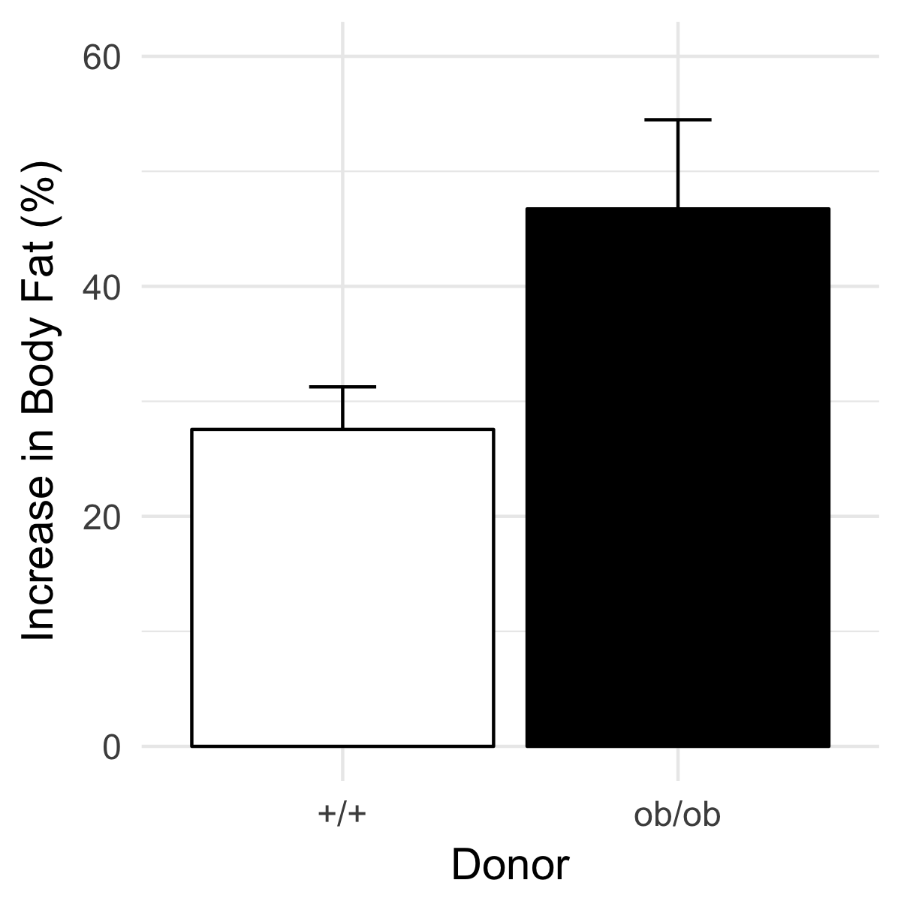

```{r setup, echo=FALSE, message=FALSE, warning=FALSE}
knitr::opts_chunk$set(echo = TRUE)

library(Hmisc)
library(ggplot2)
library(mvtnorm)
library(data.table)
#library(lme4)
#library(lmerTest)

gg_color_hue <- function(n) {
  hues = seq(15, 375, length = n + 1)
  hcl(h = hues, l = 65, c = 100)[1:n]
}

```
# Summary
This post is motivated by a twitter link to a [recent blog post](https://honey-guide.com/2018/02/13/graphic-faecal-transplants-and-obesity/) critical of the old but influential study [An obesity-associated gut microbiome with increased capacity for energy harvest](https://scholar.google.co.uk/scholar?hl=en&as_sdt=0%2C5&q=An+obesity-associated+gut+microbiome+with+increased+capacity+for+energy+harvest.&btnG=) [@Turnbaugh_obesityassociated_2006a] with [impressive citation metrics](https://www.nature.com/articles/nature05414/metrics). In the post, Matthew Dalby smartly used the available data to reconstruct the final weights of the two groups. He showed these final weights were nearly the same, which is not good evidence for a treatment effect, given that the treatment was randomized among groups.

This is true, but doesn't quite capture the essence of the major problem with the analysis: a simple *t*-test of differences in percent weight change fails to condition on initial weight. And, in pre-post designs, groups with smaller initial measures are expected to have more change due to [regression to the mean](https://en.wikipedia.org/wiki/Regression_toward_the_mean). This is exactly what was observed. In the fecal transplant study, the initial mean weight of the rats infected with *ob/ob* feces was smaller (by 1.2SD) than that of the rats infected with *+/+* feces and, consequently, the expected difference in the change in weight is not zero but positive (this is the expected difference *conditional on an inital difference*). More generally, a difference in percent change *as an estimate of the parametric difference in percent change* is not biased, but it is also not an estimate of the treatment effect, except under very limited conditions explained below. If these conditions are not met, a difference in percent change *as an estimate of the treatment effect* is biased, unless estimated conditional on (or "adusted for") the initial weight.

Regression to the mean also has consequences on the hypothesis testing approach taken by the authors. Somewhat perplexingly, a simple *t*-test of the post-treatment weights or of pre-post difference in weight, or of percent change in weight does not have elevated Type I error. This is demonstrated using simulation below. The explaination is, in short, the Type I error rate is also a function of the initial difference in weight. If the initial difference is near zero, the Type I error is much less than the nominal alpha (say, 0.05). But as the intial difference moves away from zero, the Type I error is much greater than the nominal alpha. Over the space of the initial difference, these rates average to the nominal alpha.

# The original results
Turnbaugh et al. showed that mice with feces from obese (*ob/ob*) donors had higher weight gain than mice with feces from lean (*+/+*) donors, presumably because of the differences in microbial communities between the donor types (shown elsewhere in their paper). To support the inference of a large difference in weight change, they illustrated the percent change in each treatment level in their Fig 3C, which I replicate using simulated data generated to match their summary statistics (the original data are not available). Turnbaugh et al. used a simple t-test of the percent change scores (there is also correlated error or clustering due to two donors and 4-5 recipients per donor, but I ignore this and assume independence).
```{r generate original bar plot, echo=FALSE, results='hide'}
  #sample
mouse <- data.table(treatment = c('+/+', 'ob/ob'),
                    n = c(10, 9),
                    percent = c(.27, .47),
                    change = c(.86, 1.3),
                    se_percent = c(0.036, 0.083),
                    se_change = c(0.1, 0.2)
                    )
mouse[, init:=change/percent]
mouse[, final:=init+change]
mouse[, sd:=sqrt(se_change^2*n/2)] # sample sd, assume homogenous pre/post
# reorder columns
mouse <- mouse[, .SD, .SDcols=c('treatment', 'n', 'init', 'final', 'sd', 'change', 'percent', 'se_change', 'se_percent')]

init_diff <- (mouse[2, init] - mouse[1, init])/sqrt(mean(mouse[,sd^2]))
final_diff <- (mouse[2, final] - mouse[1, final])/sqrt(mean(mouse[,sd^2]))
# generate replica fake data

percent.lean <- mouse[treatment=='+/+', percent]
percent.obese <- mouse[treatment=='ob/ob', percent]
percent.lean.se <- mouse[treatment=='+/+', se_percent]
percent.obese.se <- mouse[treatment=='ob/ob', se_percent]

  # parameters
  Sigma_ii <- mean(mouse[, sd^2]) # results in SED about average of two reported SED # sample variance
  sigma <- sqrt(Sigma_ii) # sample standard deviation
  rho <- 0.4
  mu <- mean(mouse[, init]) # common init
  delta <- mean(mouse[, change]) # delta is the post - pre effect
  tau <- 0
  Sigma <- matrix(c(c(Sigma_ii, rho*Sigma_ii), c(rho*Sigma_ii, Sigma_ii)), nrow=2)
  N <- sum(mouse[, n])

seed <- 129 # recovers stats
# seed <- 10558 #
done <- FALSE
while(done==FALSE){
  set.seed(seed)
  
  # create pre-post mouse weights that are correlated
  treatment <- rep(c('+/+','ob/ob'), mouse[,n])
  weights <- rmvnorm(n=N, mean=c(mu, mu+delta), sigma=Sigma)
  weights[treatment=='ob/ob', 2] <- weights[treatment=='ob/ob', 2] + tau
  dt <- data.table(ID=factor(1:N),
                   treatment=factor(treatment, c('+/+','ob/ob')),
                   init=weights[,1],
                   final=weights[,2])
  dt[, change:=final-init]
  dt[, percent:=change/init]
  dt_sum <- dt[, .(percent_change=mean(percent), se=sd(percent)/sqrt(.N), cs=mean(change), se.change=sd(change)/sqrt(.N)), by=treatment]
  dt_sum
  if(abs(dt_sum[treatment=='ob/ob', percent_change] - percent.obese) < 0.01 &
     abs(dt_sum[treatment=='+/+', percent_change] - percent.lean) < 0.01 &
     abs(dt_sum[treatment=='ob/ob', se] - percent.obese.se) < 0.01 &
     abs(dt_sum[treatment=='+/+', se] - percent.lean.se) < 0.005 ){
    done <- TRUE
  }else{
  seed <- seed+1
  }
  # percent.obese <- .47
  # percent.lean <- .27
  # sed.obese.percent <- .083
  # sed.lean.percent <- .036
}

gg <- ggplot(data=dt_sum, aes(x=treatment, y=percent_change*100, fill=treatment)) +
  geom_errorbar(aes(ymin=(percent_change-se)*100, ymax=(percent_change+se)*100), width=.2) +
  geom_col(fill=c('white', 'black'), color='black') +
  ylab("Increase in Body Fat (%)") +
  xlab("Donor") +
  scale_y_continuous(limits=c(0,60)) +
  theme_minimal(base_size=14) +
  theme(legend.position='none')
fn <- 'original_bar_plot.png'
ggsave(fn, width=4, height=4)
```
```{r plot original bar plot, out.width = "400px", echo=FALSE, fig.cap='**Figure** A simulated version of Fig. 3c of Turnbaugh et al. 2006'}

```
# Regression to the mean
One might reasonably expect that if mice are randomized into two groups, then the expected difference in percent change is zero. This is unconditionally true but not conditionally true. That is, if we ignore initial weight, the expected difference is zero. But, the expected difference is conditional on the initial difference in weights. More specifically, the expected difference in percent change is opposite in sign but proportional in magnitude of the initial difference. This conditional expectation is a consequence of regression to the mean. If the first measure of a random variable is extreme, the second measure will tend to be less extreme. And, if a second measure is extreme, the first measure will tend to be less extreme. 

Despite random treatment assignment, the mean initial weight of the *ob/ob* group was 1.2SD less than the mean initial weight of the *+/+* group. By contrast, the mean final weight of the *ob/ob* group was 0.06SD larger than the mean final weight of the *+/+* group. This first difference is an extreme measure. The second is extremely close to the expectation if there is no treatment effect. Because the initial difference in weight is unusually negative, the expected difference in percent change will be unusually positive.

This is pretty easy to simulate by generating fake data modeled after the mouse data by generating initial and final weights as samples from a multivariate normal distribution parameterized by the summary data from the Turnbaugh study (contained in the data.table `mouse`)
```{r simulation short}
  # parameters
  mu <- mean(mouse[, init]) # common init weight
  delta <- mean(mouse[, change]) # delta is the post - pre effect
  tau <- 0 # the treatment effect
  Sigma_ii <- mean(mouse[, sd^2]) # diagonal elements of the covariance matrix
  sigma <- sqrt(Sigma_ii) # sample standard deviation
  # rho (pre-post correlation) is set by the loop
  Sigma <- matrix(c(c(Sigma_ii, rho*Sigma_ii), c(rho*Sigma_ii, Sigma_ii)), nrow=2)
  N <- sum(mouse[, n])
  weights <- rmvnorm(n=N, mean=c(mu, mu+delta), sigma=Sigma)
```

But instead of percent change, I start with the the difference in change from baseline (or change score) between treatment (t) and control (c) groups $(Y_{t} - X_{t}) - (Y_{c} - X_{c})$, where $X$ is the intial (baseline) weight and $Y$ is the final weight.

```{r simulate regression to mean, echo=FALSE, fig.cap='**Figure**. Increased initial difference in weight results in an increased differences in change score between treatment and control. Four different values of rho (the correlation between initial and final weights) were simulated. Only when rho=1 is there no influence of initial difference, because whatever differences occur at baseline will be perfectly preserved in the final measure. The X gives the difference and change score in the original Turnbaugh data'}
niter <- 1000
n <- 10
N <- n*2
# mean change score (final - init) in mouse data
delta <- mean(mouse[, change]) # = 1.08
# mean weight at init measure
mu_0 <- mean(mouse[, init]) # = 2.98
#  pooled sd of mouse weights
sigma <- sqrt(mean(mouse[, sd]^2)) # = 0.34
d_obs.init <- mouse[treatment=='ob/ob', init] - mouse[treatment=='+/+', init]
d_obs.change <- mouse[treatment=='ob/ob', change] - mouse[treatment=='+/+', change]
d_obs.percent <- mouse[treatment=='ob/ob', percent] - mouse[treatment=='+/+', percent]

init_diff <- numeric(niter)
cs_diff <- numeric(niter)
percent_diff <- numeric(niter)
res_mat <- data.table(NULL)
for(rho in c(0, 0.33, 0.66, 1)){
  Sigma <- matrix(c(c(sigma^2, rho*sigma^2), c(rho*sigma^2, sigma^2)), nrow=2)
  for(iter in 1:niter){
    # col 1 is initial weights, col 2 is final weights
    weights <- rmvnorm(n=N, mean=c(mu, mu+delta), sigma=Sigma)
    init <- weights[,1]
    final <- weights[,2]
    change <- final - init
    percent <- change/init
    init_diff[iter] <- mean(init[1:n]) - mean(init[(n+1):(n*2)]) 
    cs_diff[iter] <- mean(change[1:n]) - mean(change[(n+1):(n*2)]) 
    percent_diff[iter] <- mean(percent[1:n]) - mean(percent[(n+1):(n*2)]) 
  }
  res_mat <- rbind(res_mat, data.table(rho=rho, init=init_diff, cs=cs_diff, percent=percent_diff))
}

# plot it
res_mat[, rho:=factor(rho)]
gg <- ggplot(data=res_mat, aes(x=init, y=cs, color=rho)) +
  geom_point() +
  geom_point(aes(x=d_obs.init, y=d_obs.change), color='black', shape='X', size=5) +
  ylab("Difference in change score") +
  xlab("Initial difference") +
  theme_minimal(base_size=14)
gg
```

The dependency of the difference in change between treatments on the initial difference between treatments is more severe if change is measured as a percent, because the numerator (the change score) is expected to be larger if the denominator is smaller (initial measure). Using the simulated data from above, here is this dependency.

```{r pecent change, echo=FALSE, fig.cap='**Figure**. Difference in percent change as a function of initial difference in weight'}
gg <- ggplot(data=res_mat, aes(x=init, y=percent, color=rho)) +
  geom_point() +
  geom_point(aes(x=d_obs.init, y=d_obs.percent), color='black', shape='X', size=5) +
  ylab("Difference in percent change") +
  xlab("Initial difference") +
  theme_minimal(base_size=14)
gg

```

# Bias as a function of difference at baseline
There are three common measures of the treatment effect in a randomized experiment with both pre-treatment and post-treatment measures: 

1. The simple difference in final measures: $\hat{\tau}_{post} = \bar Y_t - \bar Y_c$

2. The difference in change (or gain) score: $\hat{\tau}_{cs} = (\bar Y_t - \bar X_t) - (\bar Y_c - \bar X_c)$

3. The difference in percent change: $\hat{\tau}_{\%} = \bar Y'_t - \bar Y'_c$, where $Y'_i=\frac{Y_i - X_i}{X_i}$

where $X_t$ and $X_c$ are the pre-treatment (baseline) measures for treatment and control groups and $Y_t$ and $T_c$ are post-treatment measures. As in Turnbaugh et al. (2006), these difference effects are frequently tested with a simple $t$-test. It is common, however, to add the initial measure to either of the first two as a covariate in an ANCOVA model.

It is easy to show with a simple simulation that regression to the mean effects the estimate of the treatment effect $\tau$ of all three differences, except under very limited conditions, *unless the initial measure is included in the model*.

```{r Big simulation, echo=FALSE}
big_simulation <- function(){
  niter <- 2000 # number of replicates of each parameter combination
  # replicate mouse data from Turnbaugh paper
  mouse <- data.table(treatment = c('+/+', 'ob/ob'),
                      n = c(10, 9),
                      percent = c(.27, .47),
                      change = c(.86, 1.3),
                      se_percent = c(0.036, 0.083),
                      se_change = c(0.1, 0.2)
  )
  mouse[, init:=change/percent]
  mouse[, final:=init+change]
  mouse[, sd:=sqrt(se_change^2*n/2)] # sample sd, assume homogenous pre/post
  # reorder columns
  mouse <- mouse[, .SD, .SDcols=c('treatment', 'n', 'init', 'final', 'sd', 'change', 'percent', 'se_change', 'se_percent')]
  
  init_diff <- (mouse[2, init] - mouse[1, init])/sqrt(mean(mouse[,sd^2]))
  final_diff <- (mouse[2, final] - mouse[1, final])/sqrt(mean(mouse[,sd^2]))
  # generate replica fake data
  
  percent.lean <- mouse[treatment=='+/+', percent]
  percent.obese <- mouse[treatment=='ob/ob', percent]
  percent.lean.se <- mouse[treatment=='+/+', se_percent]
  percent.obese.se <- mouse[treatment=='ob/ob', se_percent]
  
  # parameters
  Sigma_ii <- mean(mouse[,sd^2]) # results in SED about average of two reported SED # sample variance
  sigma <- sqrt(Sigma_ii) # sample standard deviation
  mu <- mean(mouse[, init]) # common init
  delta <- mean(mouse[, change]) # delta is the post - pre effect
  N <- sum(mouse[, n])
  treatment <- rep(c('+/+','ob/ob'), mouse[, n])
  
  seed <- 1 # recovers stats
  
  # results matrix
  res_cols <- c('Xt', 'Xc', 'Yt', 'Yc', 'b', 'tau_post','tau_post_a', 'tau_cs', 'tau_cs_a', 'tau_per', 'tau_per_a', 'tau_lmm', 'p_post','p_post_a', 'p_cs', 'p_cs_a', 'p_per', 'p_per_a', 'p_lmm')
  res_mat <- data.table(matrix(-9999.0, nrow=niter, ncol=length(res_cols)))
  setnames(res_mat, old=colnames(res_mat), new=res_cols)
  res <- data.table(NULL)
  for(tau in c(0, 0.5*sigma, sigma)){ # tau is the treatment effect
    for(rho in c(0, 0.4, 0.8, 0.99)){ # rho is the correlation between pre-post
      # fake parameters
      Sigma <- matrix(c(c(Sigma_ii, rho*Sigma_ii), c(rho*Sigma_ii, Sigma_ii)), nrow=2)
      # cov2cor(sigma)
      for(iter in 1:niter){
        # create pre-post mouse weights that are correlated
        weights <- rmvnorm(n=N, mean=c(mu, mu+delta), sigma=Sigma)
        weights[treatment=='ob/ob', 2] <- weights[treatment=='ob/ob', 2] + tau
        dt <- data.table(ID=factor(1:N),
                         treatment=factor(treatment, c('+/+','ob/ob')),
                         init=weights[,1],
                         final=weights[,2])
        dt[, change:=final-init]
        dt[, percent:=change/init]
        
        # means
        X <- dt[, .(X=mean(init)), by=treatment]
        Y <- dt[, .(Y=mean(final)), by=treatment]
        res_mat[iter, Xt:=X[treatment=='ob/ob', X]]
        res_mat[iter, Xc:=X[treatment=='+/+', X]]
        res_mat[iter, Yt:=Y[treatment=='ob/ob', Y]]
        res_mat[iter, Yc:=Y[treatment=='+/+', Y]]
        
        # simple difference model
        coeffs <- coefficients(summary(lm(final ~ treatment, data=dt)))['treatmentob/ob',]
        res_mat[iter, tau_post:=coeffs['Estimate']]
        res_mat[iter, p_post:=coeffs['Pr(>|t|)']]
        # post score ancova model
        coeffs <- coefficients(summary(lm(final ~ init + treatment, data=dt)))
        res_mat[iter, b:=coeffs['init','Estimate']]
        res_mat[iter, tau_post_a:=coeffs['treatmentob/ob','Estimate']]
        res_mat[iter, p_post_a:=coeffs['treatmentob/ob','Pr(>|t|)']]
        
        # change score model
        coeffs <- coefficients(summary(lm(change ~ treatment, data=dt)))['treatmentob/ob',]
        res_mat[iter, tau_cs:=coeffs['Estimate']]
        res_mat[iter, p_cs:=coeffs['Pr(>|t|)']]
        # change score ancova model = post score ancova model for tau
        coeffs <- coefficients(summary(lm(change ~ init + treatment, data=dt)))['treatmentob/ob',]
        res_mat[iter, tau_cs_a:=coeffs['Estimate']]
        res_mat[iter, p_cs_a:=coeffs['Pr(>|t|)']]
        
        # percent model
        coeffs <- coefficients(summary(lm(percent ~ treatment, data=dt)))['treatmentob/ob',]
        res_mat[iter, tau_per:=coeffs['Estimate']]
        res_mat[iter, p_per:=coeffs['Pr(>|t|)']]
        # percent ancova model
        coeffs <- coefficients(summary(lm(percent ~ init + treatment, data=dt)))['treatmentob/ob',]
        res_mat[iter, tau_per_a:=coeffs['Estimate']]
        res_mat[iter, p_per_a:=coeffs['Pr(>|t|)']]
        
        # mixed model
        do_mixed <- FALSE
        if(do_mixed==TRUE){
          dt_long <- melt(data=dt, id.vars=c('ID', 'treatment'), measure.vars=c('init', 'final'), variable.name='time', value.name='weight')
          fit_lmm <- lmer(weight ~ treatment*time + (1|ID), data=dt_long)
          res_mat[iter, tau_lmm:=coefficients(summary(fit_lmm))['treatmentob/ob:timefinal','Estimate']]
          res_mat[iter, p_lmm:=coefficients(summary(fit_lmm))['treatmentob/ob:timefinal','Pr(>|t|)']]
          # coefficients(summary(fit_lmm))
          # coefficients(summary(lm(weight~treatment*time, data=dt_long)))
          # coefficients(summary(lm(change~init+treatment, data=dt)))
        }
        
        # check an actual run to look at pattern if type I error in cs model and in cs + init model
        if(res_mat[iter, p_cs] < 0.05 & res_mat[iter, p_cs_a] > 0.05){
          gdt_cs <- copy(dt)
        }
        if(res_mat[iter, p_cs_a] < 0.05 & res_mat[iter, p_cs] > 0.05){
          gdt_cs_a <- copy(dt)
        }
        
        # sed
        # coefficients(summary(lm(change ~ init + treatment, data=dt)))
      }
      res <- rbind(res, data.table(rho=rho, tau=tau, res_mat))
    }
  }
  
  code <- paste(sample(LETTERS, 6), collapse='')
  fn <- paste('big_sim',code, 'Rda', sep='.')
  if(save_it==TRUE){
    save(res, file=fn)
  }
}
```

```{r load big_sim, echo=FALSE}
load('big_sim.NSHKBZ.Rda') # will be data.table 'res'

# need mouse data
d_obs.init <- mouse[treatment=='ob/ob', init] - mouse[treatment=='+/+', init]
d_obs.change <- mouse[treatment=='ob/ob', change] - mouse[treatment=='+/+', change]
d_obs.percent <- mouse[treatment=='ob/ob', percent] - mouse[treatment=='+/+', percent]

# bias when tau = 0
res[, init_diff:=Xt-Xc]
res[, rho:=factor(rho)]
```

## Bias in absolute change

```{r bias in tau raw, echo=FALSE, fig.cap='**Figure** Influence of rho and tau on the error in the estimate of the treatment effect'}
# create display treatment levels
res[, tau_disp:=factor(paste('tau ==', round(tau/sigma,1)))]
res[, rho_disp:=factor(paste('rho ==', rho))]

compare <- c('tau_post', 'tau_cs', 'tau_cs_a')
big_melt_bias_raw <- melt(res, id.var=c('rho_disp', 'tau_disp', 'rho', 'tau', 'init_diff'), measure.vars=compare, variable.name='method', value.name='tau_hat')
big_melt_bias_raw[, error:=tau_hat - tau]
# big_melt_bias_raw[, .(mean_error=mean(error), tau_hat=mean(tau_hat)), by=.(method, rho, tau)]

cols <- gg_color_hue(length(compare))
gg <- ggplot(data=big_melt_bias_raw, aes(x=init_diff, y=error, color=method)) +
  geom_point() +
  ylab(expression(paste('Error ', (hat(tau) - tau)))) +
  xlab('Initial Difference') +
  scale_colour_manual(values = cols, labels = expression(hat(tau)['post'], hat(tau)['cs'], hat(tau))) +
  facet_grid(rho_disp~tau_disp, labeller = label_parsed) +
  theme_minimal()

gg

```

Each panel in the plot above shows the error in the estimate of the treatment effect as a function of the initial difference ($X_t - X_c$), the correlation between pre-treatment and post-treatment measures ($\rho$), and the standardized treatment effect $(\tau/\sigma)$. Three estimators are compared: the difference in final measure ($\hat{tau}_{post}$), the difference in change score ($\hat{tau}_{cs}$), and the difference in the change score adjusted for initial measure ($\hat{tau}$). The error in both $\hat{tau}_{post}$ and $\hat{tau}_{cs}$ are functions of the initial difference, except at some very specific value of $\rho$. $\hat{tau}_{post}$ is not dependent on the initial difference only if $\rho=0$ while $\hat{tau}_{cs}$ is not dependent on the initial difference only if $\rho=1$. If we want our statistical inference to be independent of the initial difference, a simple $t$-test of post-treatment differences would have to assume that final measures are not at all predictable from initial measures while a simple $t$-test of the change scores would have to assume that final measures are entirely predictable from initial measures.
 
## Bias in percent change
```{r bias in tau percent, echo=FALSE, fig.cap='**Figure** Influence of rho and tau on the error in the estimate of the treatment effect with percent change as the outcome'}
# create display treatment levels
res[, tau_disp:=factor(paste('tau ==', round(tau/sigma,1)))]
res[, rho_disp:=factor(paste('rho ==', rho))]

compare <- c('tau_per', 'tau_per_a')
big_melt_bias_per <- melt(res, id.var=c('rho_disp', 'tau_disp', 'rho', 'tau', 'init_diff'), measure.vars=compare, variable.name='method', value.name='tau_hat')
mu <- mean(mouse[, init]) # common init
big_melt_bias_per[, error:=tau_hat - tau/mu]

# big_melt_bias_per[, .(mean_error=mean(error), tau_hat=mean(tau_hat)), by=.(method, rho, tau)]

cols <- gg_color_hue(length(compare))
gg <- ggplot(data=big_melt_bias_per, aes(x=init_diff, y=error, color=method)) +
  geom_point() +
  ylab(expression(paste('Error ', (hat(tau) - tau)))) +
  xlab('Initial Difference') +
  scale_colour_manual(values = cols, labels = expression(hat(tau)['%'], hat(tau)*minute)) +
  facet_grid(rho_disp~tau_disp, labeller = label_parsed) +
  theme_minimal()
gg

```

The plot above shows the error in the estimate of the treatment effect using the percent change $(\hat{\tau}_{\%})$, as in Turnbaugh et al. (2006), and the percent change with the initial measure as a covariate in a linear model $(\hat{\tau}')$. $(\hat{\tau}_{\%})$ is a function of the initial difference and, unlike the simple post-treatment difference or the change score, there is no $\rho$ for which this dependency goes to zero.

# What about p-values?
Again, the unconditional Type I error for the *t*-test of post, change, or percent scores is the nominal $\alpha$ (here, set to 0.05), as seen using the simulation results.
```{r type I, echo=FALSE, fig.cap='**Figure** Unconditional Type I error for different methods of estimating the treatement effect *tau*'}
# type I/II error - no excessive type I error in biased estimators but...
big_melt_T1 <- melt(res[tau==0], id.vars=c('rho','tau'), measure.vars=c('p_post', 'p_cs','p_per', 'p_cs_a','p_per_a'), variable.name='method', value.name='prob')
big_melt_T1[, rho:=factor(rho)]
#big_melt_T1[, tau:=factor(round(tau,2))]
big_melt_T1[, t1:=ifelse(prob<=0.05, 1, 0)]
#big_melt_T1[, t2:=ifelse(prob>0.05, 1, 0)]
niter <- big_melt_T1[,.(N=.N), by=.(rho, method)][1,N]
T1_table <- big_melt_T1[, .(t1=sum(t1)/niter), by=.(rho, tau, method)]
gg <- ggplot(data=T1_table, aes(x=rho, y=t1, group=method, color=method)) +
  geom_point() +
  geom_line() +
  ylab("Type I error") +
  scale_color_discrete(labels=c(expression(hat(tau)[post]),
                                expression(hat(tau)[cs]),
                                expression(hat(tau)['%']),
                                expression(hat(tau)),
                                expression(hat(tau)*minute))) +
  theme_minimal() +
  theme(legend.text.align = 0)
gg

```

Likewise, conditional Type I error of the treatment effect (the frequency of Type I error with initial weight in the linear model) is not a function of initial difference in weight.
```{r Conditional type I ancova, echo=FALSE, fig.cap='**Figure** Type I error using the difference in change score conditioned on inital weight as the estimate of the treatment effect is not a function of the initial difference in weight (rho=0.4)'}
# model probabilty of error as a function of init_diff using logistic
sub_res <- res[tau=="0",]
sub_res[, abs_init_diff:=abs(init_diff)]
sub_res[, t1:=ifelse(p_cs_a<=0.05, 1, 0)]
# sub_res <- res[rho==0.4,]
# unconditional model
gg <- ggplot(data=sub_res[rho==0.4], aes(x=abs_init_diff, y=t1)) +
  geom_smooth(method='glm', method.args=list(family='binomial')) +
  ylab("Probability of Type I Error") +
  xlab(expression(paste("|",X[t] - X[c],"|"))) +
  theme_minimal()
gg
```

But, the conditional Type I error for any of the simple difference scores is strongly dependent on the initial difference in weight, which I show for both the absolute change score and the percent change.

```{r Conditional type I cs, echo=FALSE, fig.cap='**Figure** Type I error using the difference in change score as the estimate of the treatment effect is much less than 0.05 when the initial difference in weight is near zero but much greater than 0.05 when the initial difference is large (rho=0.4)'}
# model probabilty of error as a function of init_diff using logistic
sub_res <- res[tau=="0",]
sub_res[, abs_init_diff:=abs(init_diff)]
sub_res[, t1:=ifelse(p_cs<=0.05, 1, 0)]
# sub_res <- res[rho==0.4,]
# unconditional model
gg <- ggplot(data=sub_res[rho==0.4], aes(x=abs_init_diff, y=t1)) +
  geom_smooth(method='glm', method.args=list(family='binomial')) +
  ylab("Probability of Type I Error") +
  xlab(expression(paste("|",X[t] - X[c],"|"))) +
  theme_minimal()
gg
```

```{r Conditional type I percent, echo=FALSE, fig.cap='**Figure** Type I error using the difference in percent change is much less than 0.05 when the initial difference in weight is near zero but much greater than 0.05 when the initial difference is large (rho=0.4)'}
# model probabilty of error as a function of init_diff using logistic
sub_res <- res[tau=="0",]
sub_res[, abs_init_diff:=abs(init_diff)]
sub_res[, t1:=ifelse(p_per<=0.05, 1, 0)]
# sub_res <- res[rho==0.4,]
# unconditional model
gg <- ggplot(data=sub_res[rho==0.4], aes(x=abs_init_diff, y=t1)) +
  geom_smooth(method='glm', method.args=list(family='binomial')) +
  ylab("Probability of Type I Error") +
  xlab(expression(paste("|",X[t] - X[c],"|"))) +
  theme_minimal()
gg
```

# Finally Some Math

The conclusions derived from the plots of the data from the simulation experiment are easy to derive using simple algebra.

## A conditionally unbiased estimator of the treatment effect
**The coefficient of the treatment variable in an ANCOVA-like linear model with the initial measure as a covariate is an unbiased estimator of the treatment effect in randomized designs**

In a randomized experiment with a pre-treatment measure $X$ and a post-treatment measure $Y$, an unbiased estimate of the treatment effect $\tau$ is found by modeling the post-treatment measure using the ANCOVA-like linear model
$$Y = \alpha + \beta X + \tau T$$
where $T$ is a dummy variable indicating treatment assignment with $T=0$ assigned to the control group and $T=1$ to the treated group. If the pre-treatment and post-treatment variance is the same, then $\beta$ is the correlation between initial and final measures.

The equivalent estimate of $\tau$ can be computed by modeling the change score $Y - X$
$$Y - X = \alpha + \beta^* X + \tau T$$
but the coefficient of $X$ is now $\beta - 1$.

## Conditionally biased estimators
**The three difference measures are conditionally biased**

The three difference measures given above have unconditional expectations of zero in a randomized experiment with no true effect ($\tau = 0$). But, and this is an important but, all three have non-zero expectations conditioned on the initial difference ($\bar X_t - \bar X_c$). Each of the three difference statistics makes a very specific assumption about the value of $\beta$, which is a function of the pre-post correlation ($\rho$). As the difference between $\beta$ and its assumed value increases, the rate of magnitude (Type M) and sign (Type S) error of these effects increase. Or, in a hypothesis testing framework, there will be increased Type I error as $\beta$ moves away from its assumed value, *despite* an uncoditional Type I error equal to 0.05 (or whatever value set by the investigator). 

To see how these difference effects are related to $\tau$, and to show the added assumption of each difference measure, break up the linear model above by treatment level:

$$\bar Y_c = \alpha + \beta \bar X_c$$
for the control group and 

$$\bar Y_t = \alpha + \beta \bar X_t + \tau$$
for the treatment group. We can use these to show how each difference effect is dependent on $\beta$.

1. the simple difference in final measures: $\hat{\tau}_{post} = \bar Y_t - \bar Y_c$

Note that

$$\hat{\tau}_{post} = \bar Y_t - \bar Y_c = \tau + \beta(\bar X_t - \bar X_c)$$

and, consequently, the simple difference in final measures as an estimate of $\tau$, is biased by $\beta(X_t - X_c)$. If $\beta$ does not equal 0, the simple difference is dependent on the difference in initial measures. 

2. the change score: $\hat{\tau}_{cs} = (\bar Y_t - \bar X_t) - (\bar Y_c - \bar X_c)$

To see how this is related to $\tau$, re-arrange the above equation for $\hat{\tau}_{post}$ to solve for $\tau$

$$\tau = (\bar Y_t - \bar Y_c) - \beta(\bar X_t - \bar X_c)$$
and re-arrange this to
$$\tau = (\bar Y_t - \beta \bar X_t) - (\bar Y_c - \beta \bar X_c)$$
This equation is that for the change score if $\beta=1$. If $\beta \ne 1$, the change score is dependent on the difference in initial measures.

3. the difference in percent change: $\hat{\tau}_{\%} = \bar Y'_t - \bar Y'_c$, where $Y'_i=\frac{Y_i - X_i}{X_i}$

For the percent change, the relationship is similar to that for the simple difference, only the linear model fits the percent change instead of simple difference.

$$\bar Y'_c = \alpha' + \beta' \bar X_c$$
and 

$$\bar Y'_t = \alpha' + \beta' \bar X_t + \tau'$$
where $\tau'$ is the unbiased effect on the percent change. As above, 

$$\hat{\tau}_{\%}  = \bar Y'_t - \bar Y'_c = \tau' + \beta'(\bar X_t - \bar X_c)$$
and, like the simple difference, the percent difference is dependent on the initial difference unless $\beta'=0$

# Conclusions and Recommendations

It is not wrong to use a simple *t*-test to compare means among treatment levels because the unconditional estimate of the effect is not biased and the Type I error (if one wants a $p$-value) is the nominal $\alpha$. *But*, if one has a measure of the pre-treatment measure, then the conditional estimate (with the initial measure in the model) is a better estimate of the effect than the unconditional estimate. *And*, contrary to some advice and maybe to intuition, it makes no sense to use a *t*-test of the difference in initial measures to decide how to proceed. First, a null-hypothesis significance test cannot tell you that there is "no difference" -- this is not what null-hypothesis tests do. Second, any $p$-value after the initial test isn't strictly valid as it does not take into account this decision step. Third, it doesn't matter; there will always be some difference in the actual means of the initial measures and, consequently, the conditional expectation of the final measures, or change in measures, or percent change will be dependent on this initial difference. So, if one has initial measures, one should use an ancova-like linear model to estimate the treatment effect in pre-post designs.

# Other Reading
[@Overall_Directional_1992] presents results on the conditional distribution of Type I error similar to mine above. Other published simulations seem to focus more on the unconditional Type I error or power, which fails to really show why we want to condition our analysis on initial measures.

[@Liang_Longitudinal_2000, @Senn_Change_2006, @Liu_Should_2009] are good sources for the analysis of pre-post data from experiments.

[Frank Harrell](http://www.fharrell.com/post/errmed/#change) has a nice post with issue in analyzing change scores. Also [@Bland_Comparisons_2011, @vanBreukelen_ANCOVA_2013] highlight related issues in the analysis of pre-post designs.


